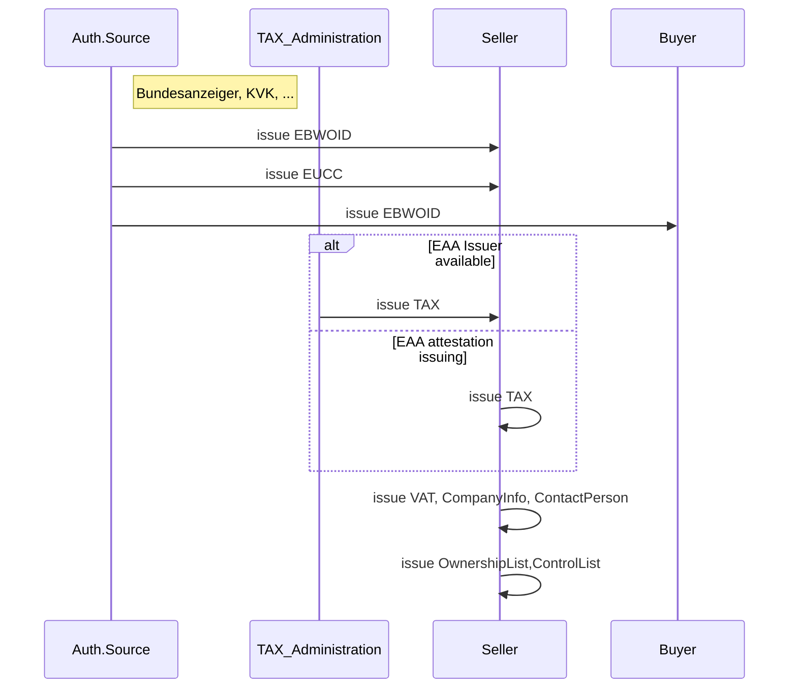
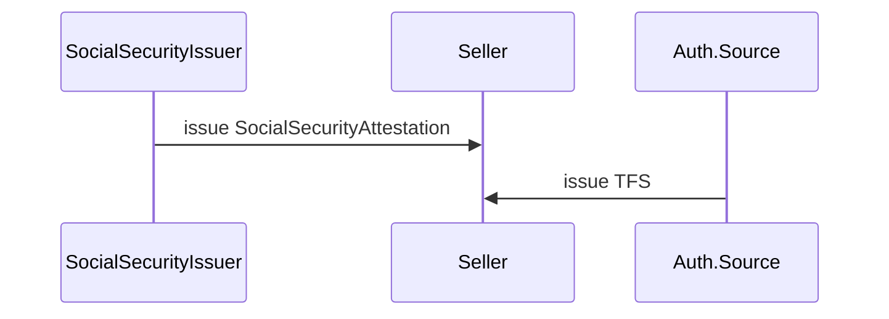
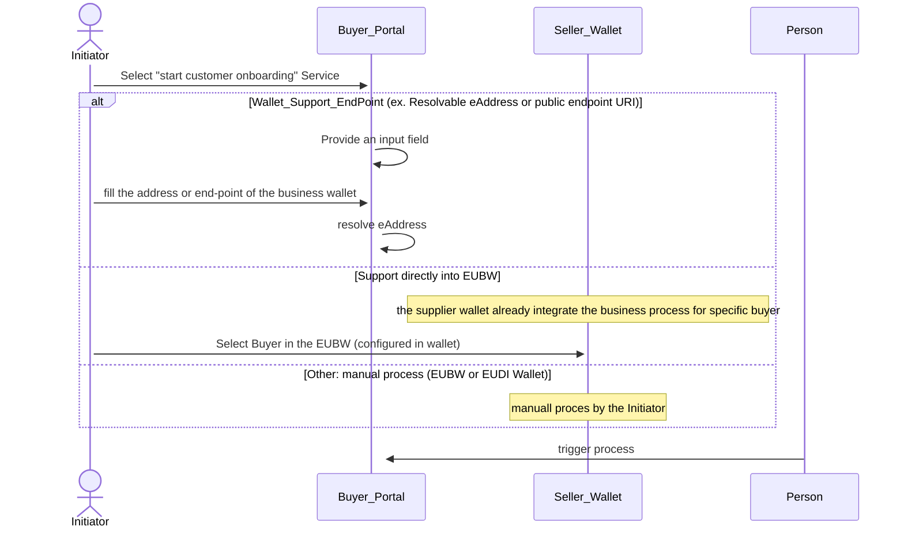
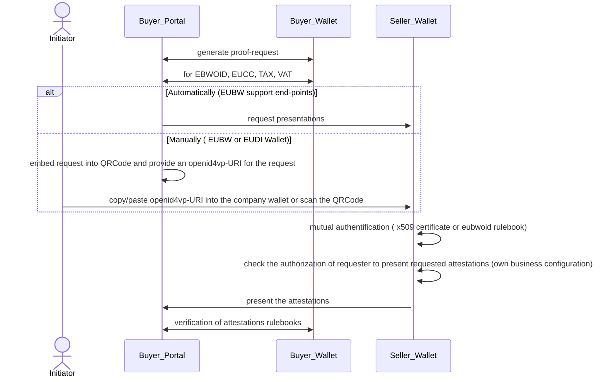
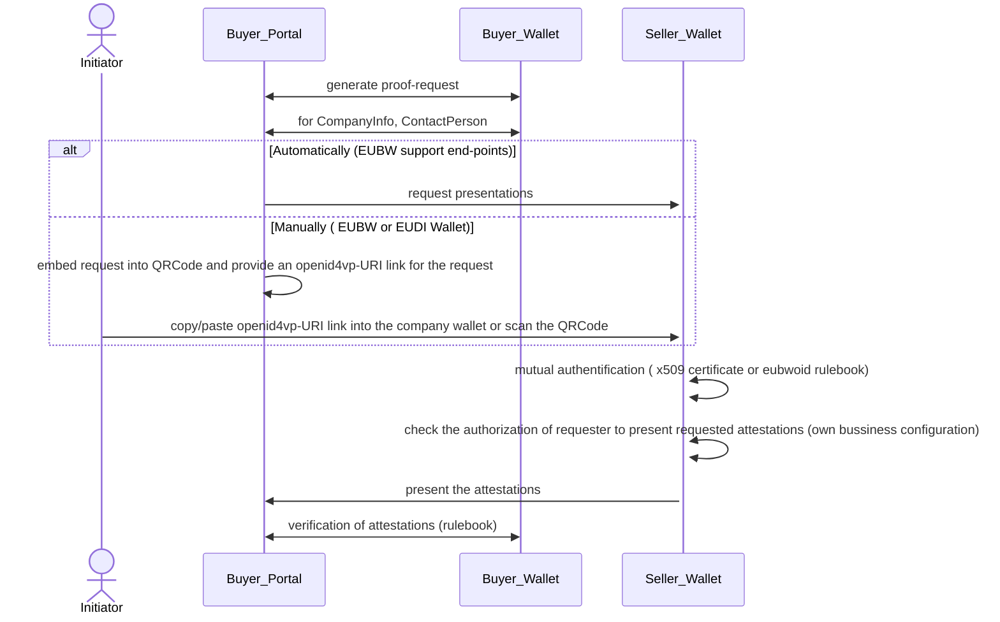
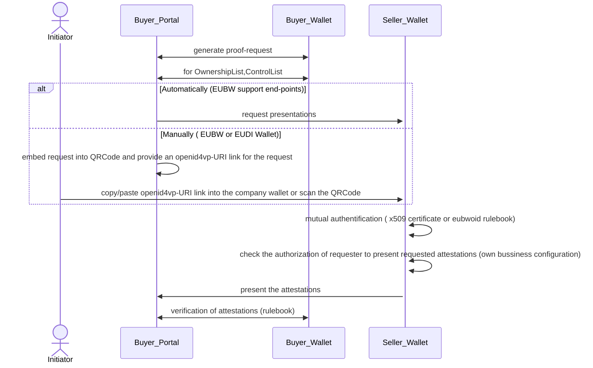
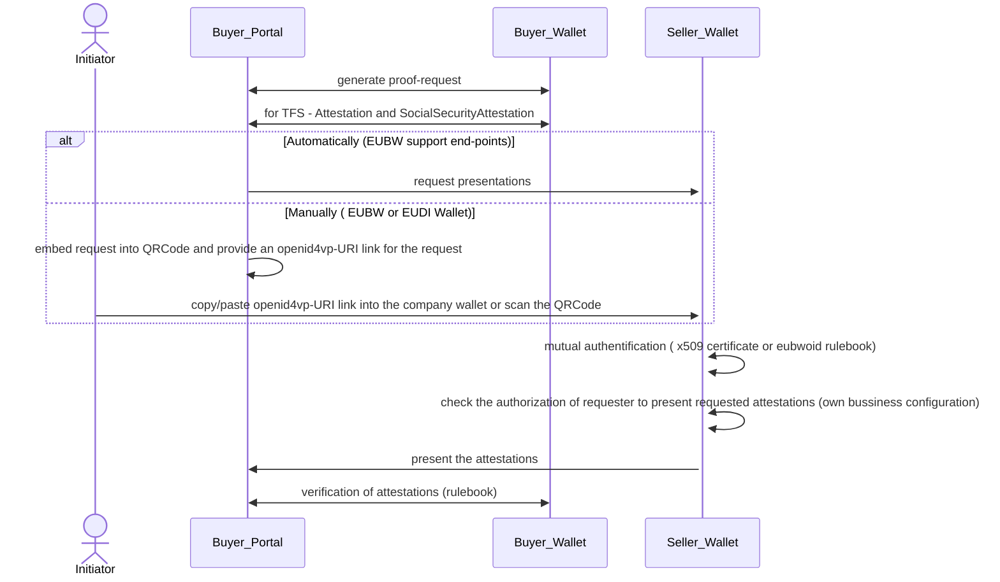

# BU1 KYC_KYS MVP Workflow

1) MVP Restrictions:
## Seller/Holder Perspective
- Any person can trigger the process of customer onboarding
- The company is authorized to present attestations and receive attestations (no configuration support)
- Mutual authentication is set to default true (no TLOL or device-binding checks are applied).
- The MVP process is executed sequentially in one step.

## Buyer/RelyingParty Perspective 
- The seller will be classified as low/medium risk customer. It will be no high-risk customer  (therefore, e.g.: no sanction screening is required)

2) MVP+ Extension:
## Seller Perspective
- Additionally support for the KYC sanction validation

## Pre-requisites
1) This are the pre-requisites for the company in order to run the MVP 

2) This are the additionally pre-requisites for the company in order to run the MVP+

### 1. Scenario KYC 

### 1.1. Legal Entity Selection

### 1.2. LegalEntity Identification

### 1.3. KYC - Base Information

### 1.4. KYC - Customer Due Diligence  Information  

### 1.5. Additionally KYC Screening Information (this will be handled in the MVP+)

### 1.6. Cross-Check

