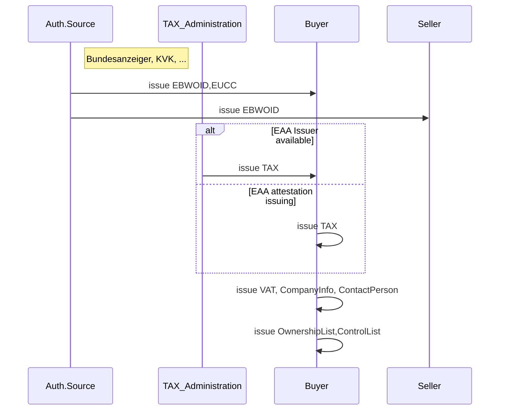
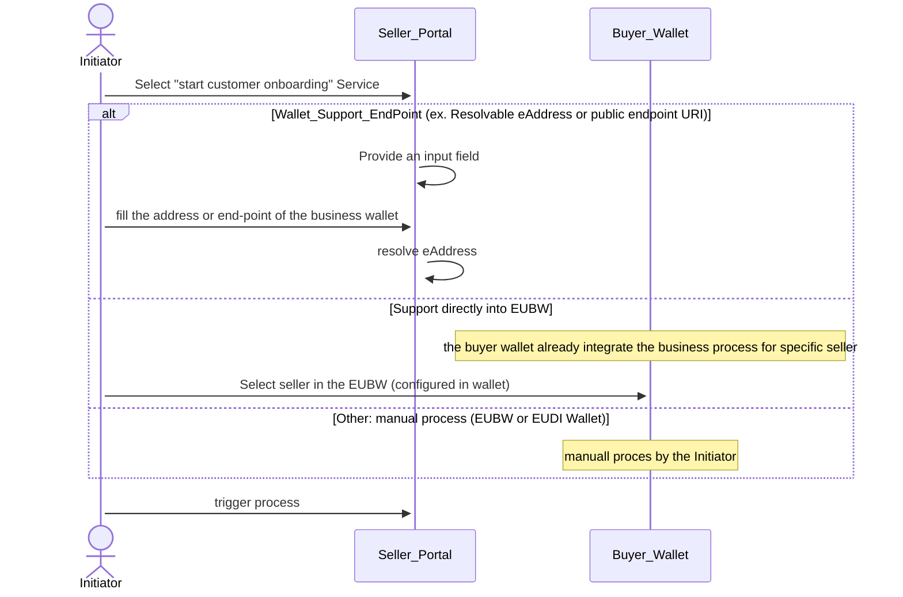
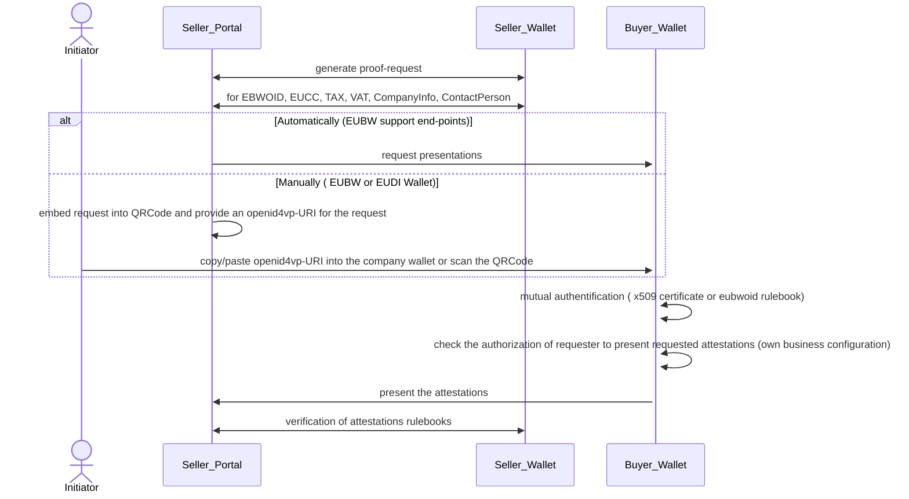
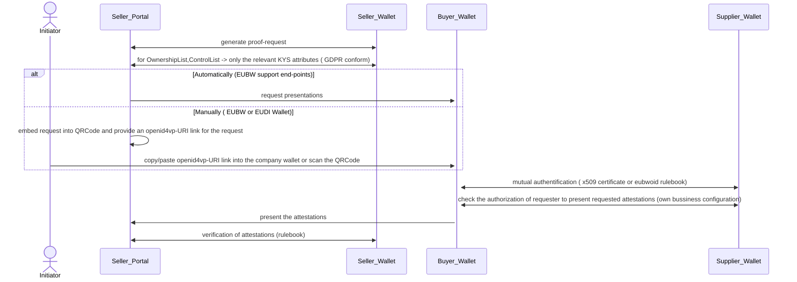
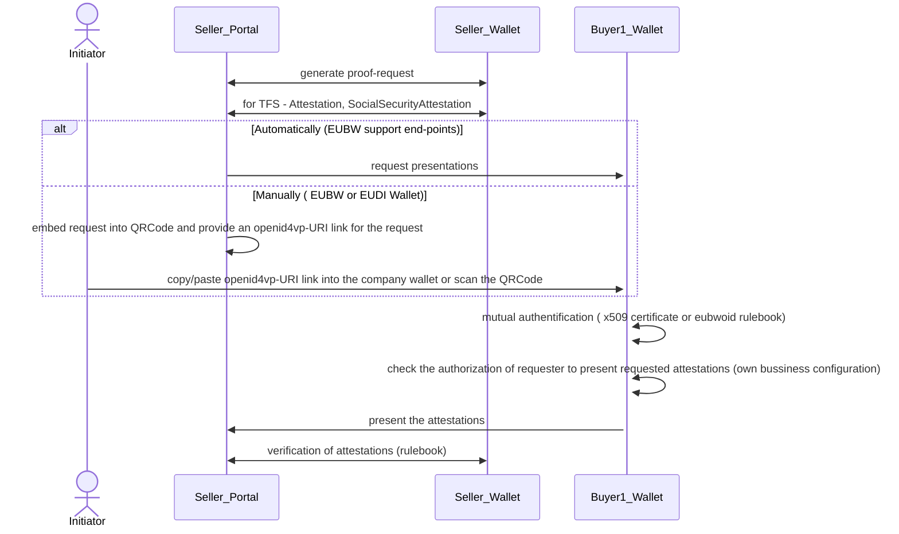
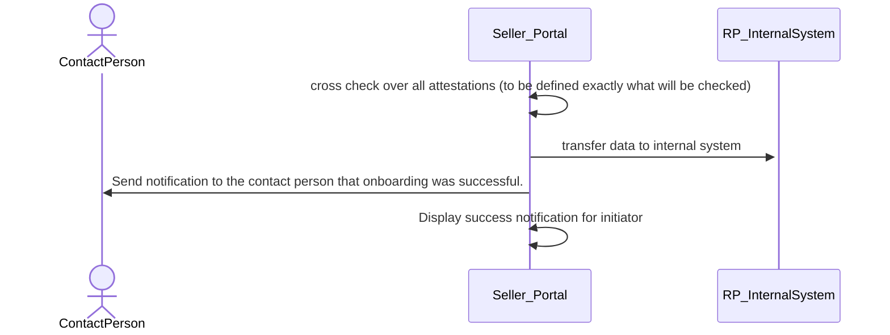

# BU1 KYC_KYS MVP Workflow

MVP Restrictions:
## Buyer Perspective (Holder)
- The person who initiated the customer onboarding is the contact person.
- Mutual authentication is set to default true (no TLOL or device-binding checks are applied).
- The buyer wallet is authorized to present attestations and receive attestations (no configuration support)
- The MVP process is executed sequentially in one step.

## Seller Perspective (RelyingParty) 
- The buyer will be classified as low/medium risk customer. It will be no high-risk customer  (therefore, e.g.: no sanction screening is required)

MVP+ Extension:
## Seller Perspective
- Additionally support for the KYC sanction validation

## Pre-requisites
1) This are the pre-requisites for the company in order to run the MVP 

2) This are the additionally pre-requisites for the company in order to run the MVP+

### 1. Scenario KYC 

### 1.1. Legal Entity Selection

### 1.2. LegalEntity Base Identification

### 1.3. KYC - Customer Due Diligence  Information

### 1.4. KYC-Screening and additionally Information (this will be handled in the MVP+)

### 1.5. Cross-Check

