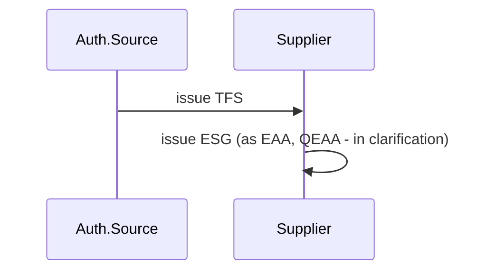
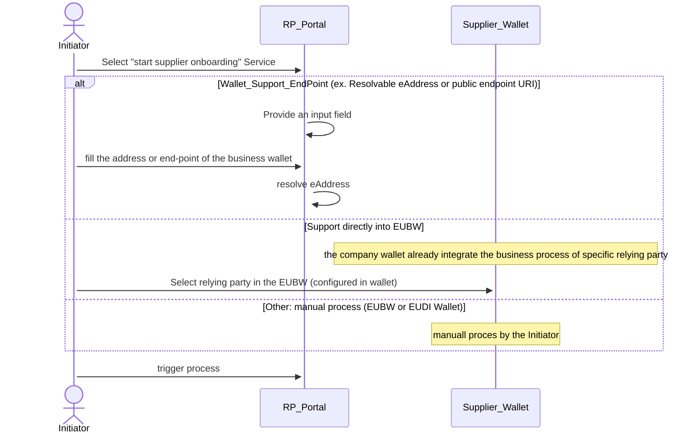
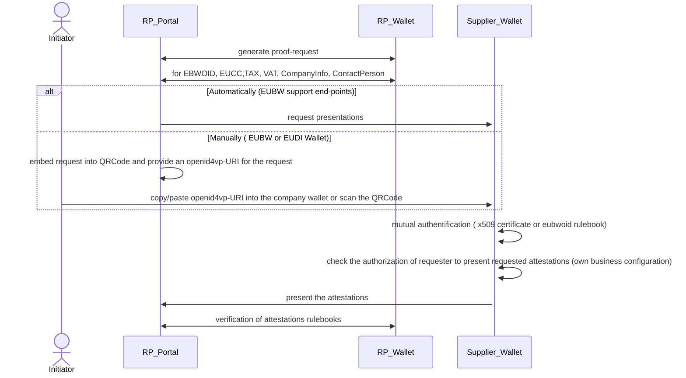
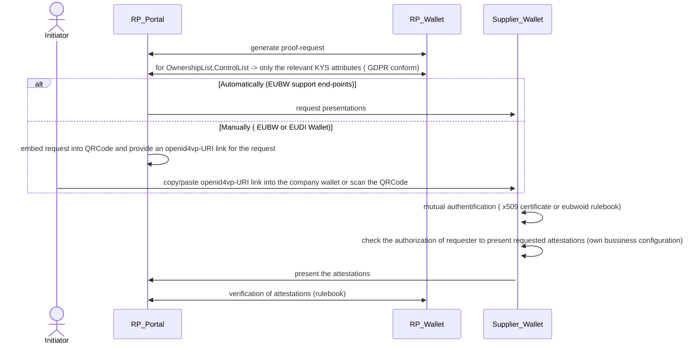
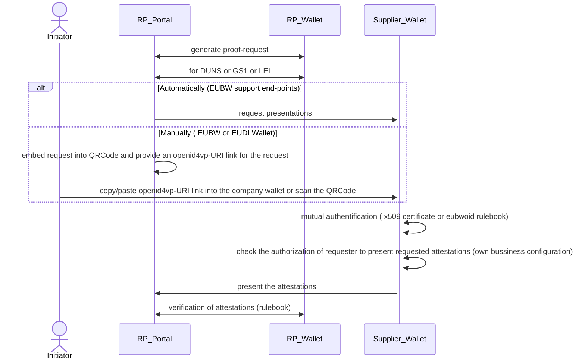
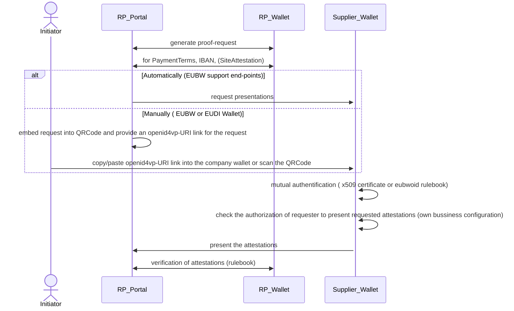
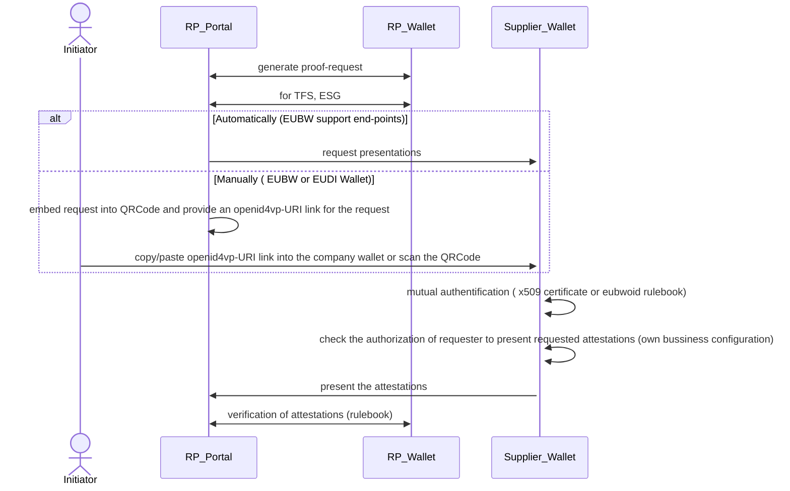
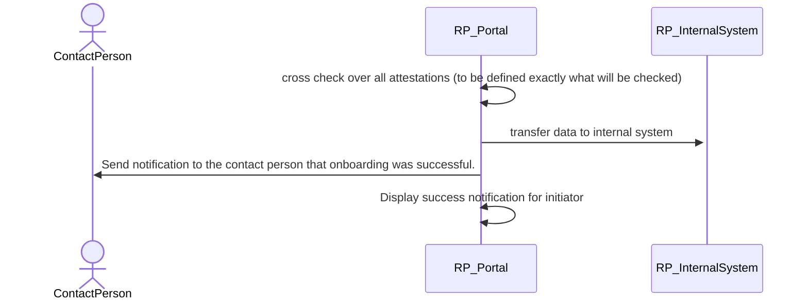

# BU1 KYS MVP Workflow

MVP Restrictions:
## Supplier Perspective (Holder)
- The person who initiated the customer onboarding is the contact person.
- The Mutual authentication is set to default true (no TLOL or device-binding checks are applied).
- The supplier wallet  is authorized to present attestations and receive attestations (no configuration support)
- The MVP process is executed sequentially in one step.

## Customer Perspective (RelyingParty) 
- The supplier will be classified as low/medium risk supplier. It will be no high-risk supplier  (therefore, e.g.: no sanction screening is required)

MVP+ Extension:
## Supplier perspective
- Additionally support for the KYS sanction validation 
- Additionally support for the ESG Certificates 

## Pre-requisites
This are the pre-requisites for the company in order to run the MVP and MVP+

```mermaid
sequenceDiagram
    participant Auth.Source 
    note right of Auth.Source : Bundesanzeiger, KVK, ...
    participant TAX_Administration 
    participant Supplier
    participant Customer 
    participant Bank
    
    Auth.Source ->> Supplier : issue EBWOID, EUCC 
    Auth.Source ->> Customer : issue EBWOID
    
    alt PubEAA Issuer available
        TAX_Administration ->> Supplier : issue TAX
    else EAA attestation issuing
        Supplier ->> Supplier: issue TAX
    end
    Supplier ->> Supplier: issue VAT, CompanyInfo,  ContactPerson
    Supplier ->> Supplier: issue OwnershipList,ControlList    
    
    alt Supplier has LEI Number 
        LEI ->> Supplier: issue LEI
    else Supplier has GLN Number
        GS1 ->> Supplier: issue GLN
    else Supplier has DUNS Number        
        Supplier ->> Supplier: issue DUNS
    end 
    
    alt Supplier has a Site 
        Supplier ->> SiteAttestation
    end
    
    Supplier ->> Supplier: issue PaymentTerms  
    Bank ->> Supplier: issue IBAN 
    
```

This are the additionally pre-requisites for the company in order to run the MVP+

### 1. Scenario KYC 

### 1.1. Legal Entity Selection


### 1.2. LegalEntity-Base Identification



### 1.3.1 KYS - Supplier Due Diligence  Information


### 1.3.2. KYS - Additionally identifier Information

### 1.3.3. KYS - Payment and other additionally Information


### 1.3.4. KYS-Screening and additionally Information (this will be handled in the MVP+)



### 1.4. Cross-Check  

