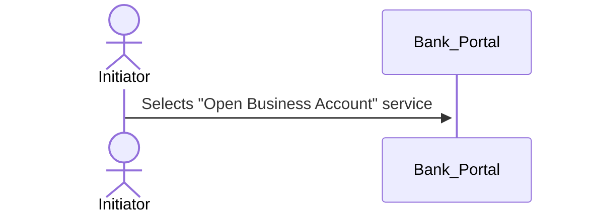

# PA3 Workflow 

**Author(s):**  

**Previous Authors:**  
–

**Versioning**

| Version | Date       | Description    |
|---------|------------|----------------|
| 0.1     | 2025-09-29 | Initial draft  |

**Feedback:**  

---

## 1 Introduction
bla bla

### 1.1. Scenario1

## Paragraph


#include "https://github.com/flo0x/wp3-technology-standards/blob/main/PA3/block1.mmd"