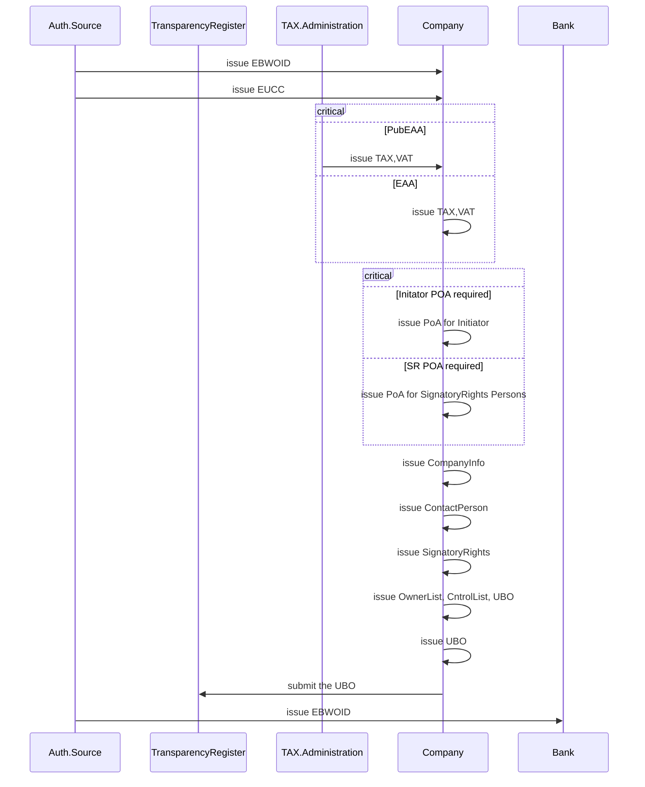
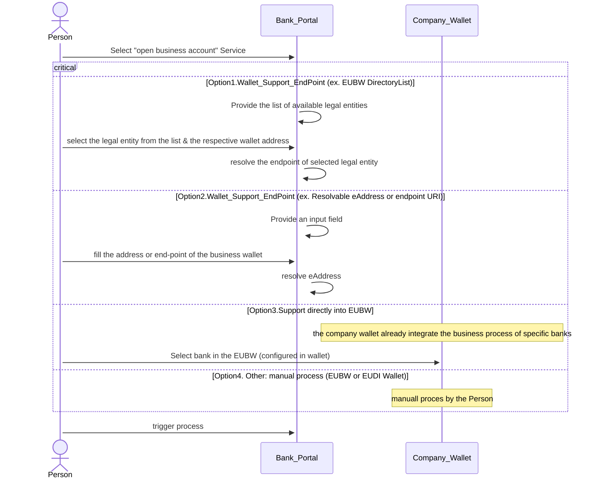
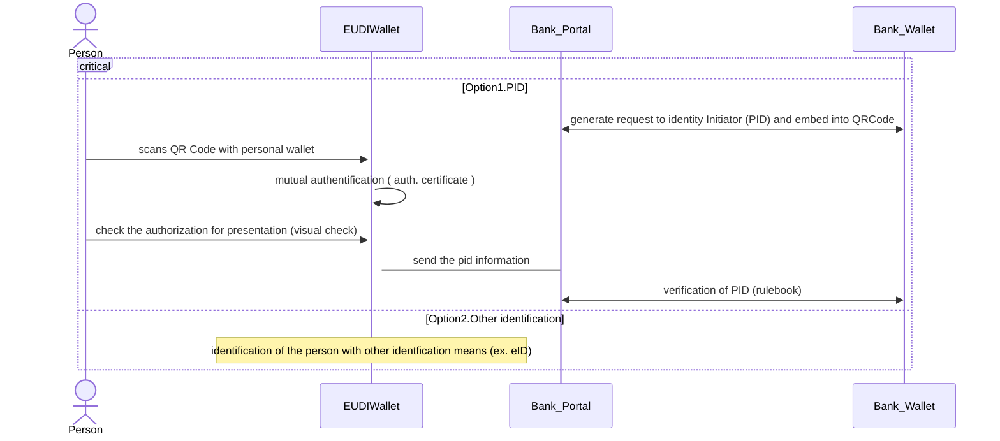
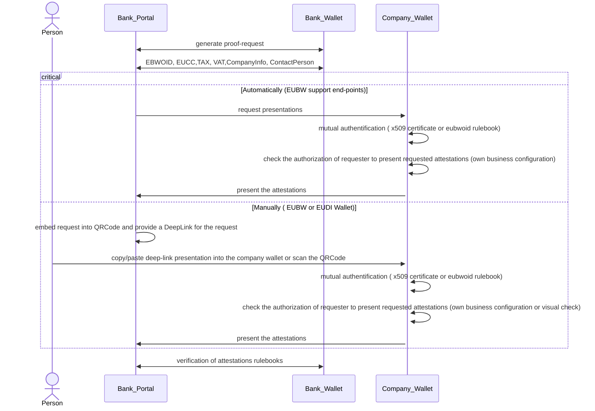
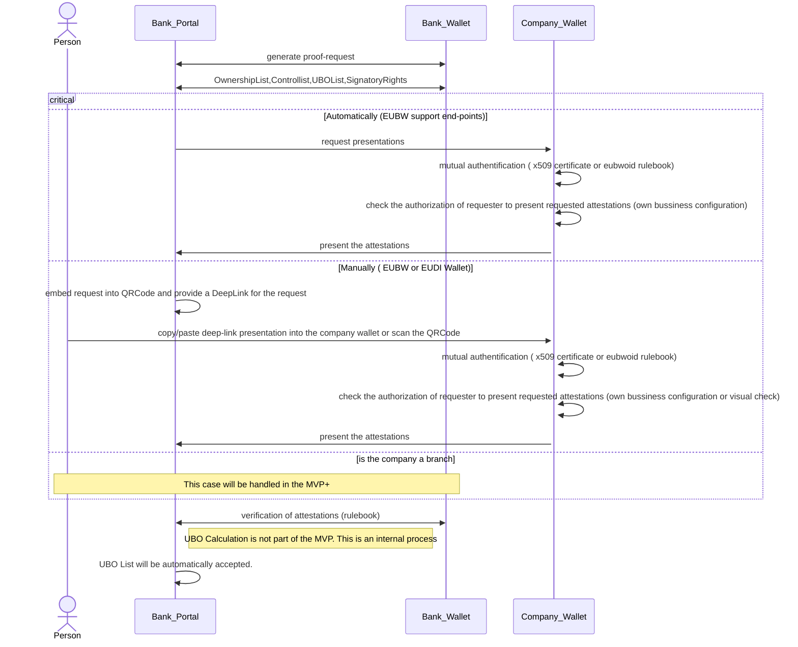
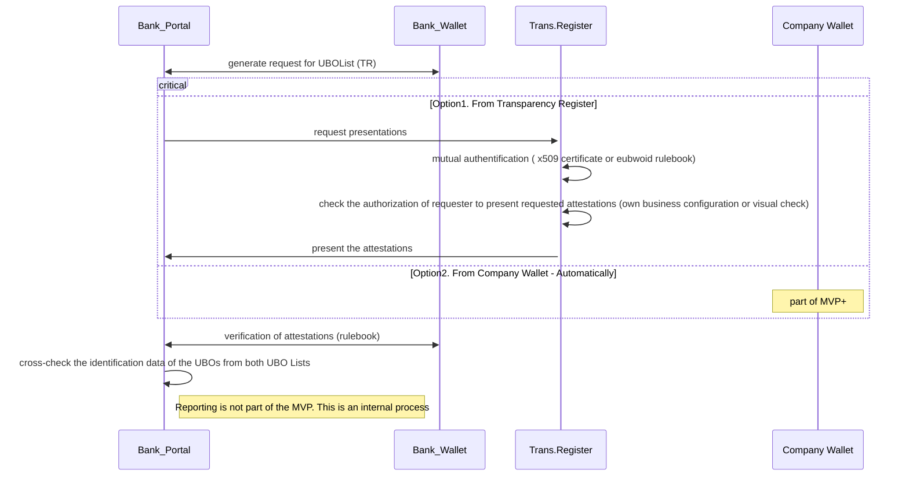
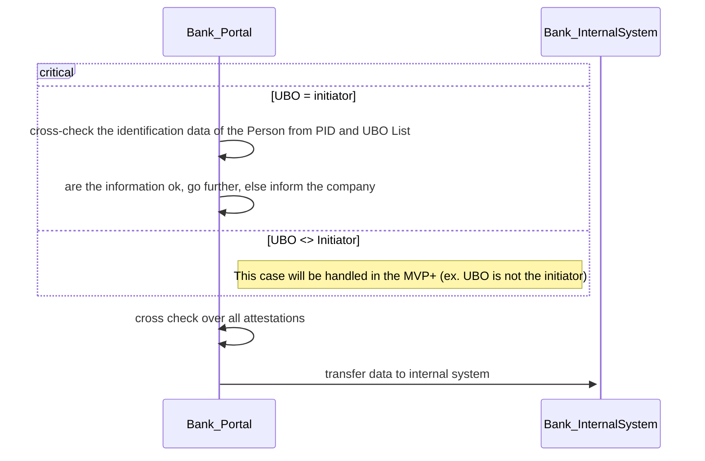
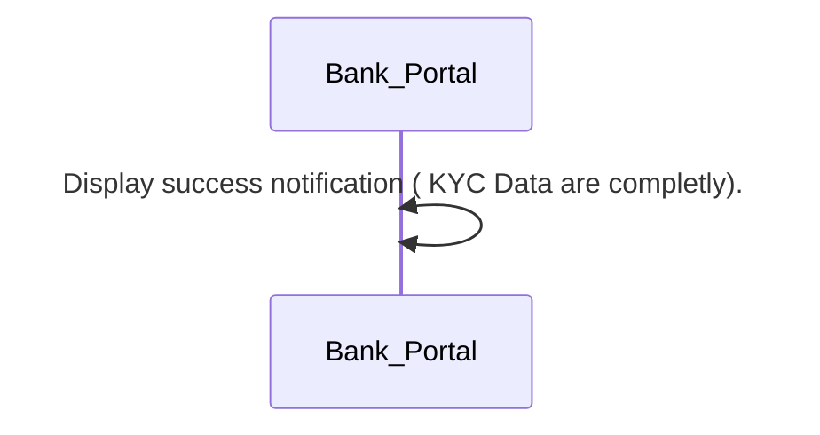
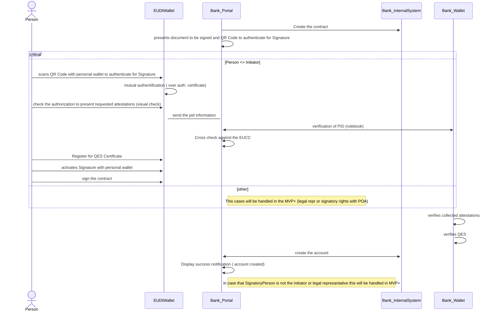
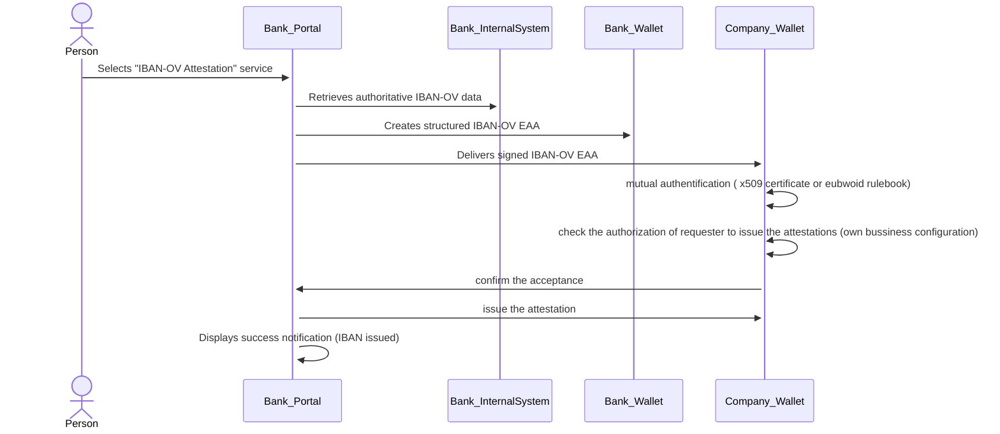

# PA3 MVP Workflow
MVP Restrictions
- 
## Pre-requisites

### 1. Scenario 1 

### 1.2. Legal Entity Selection

### 1.2. Initiator Identification 

### 1.3. LegalEntity Identification

### 1.4. Initiator Authorization (MVP+)

### 1.5. Additionally KYC information

### 1.5. UBOList from Transparency Register

### 1.6. UBOs Verification 

### 1.6. Success  

### 2. Scenario 2

### 2.1. Contract signing 

### 3. Scenario 3

### 3.1. IBAN Issuing

