# PA3 MVP Workflow

MVP Restrictions:
## Company Perspective
- The person who initiated the account opening process is also: legal representative, UBO and contact person (to make it simple: 4 positions in 1; one-person GmbH in Germany, covering SME-cases)”
- The initiator is the sole legal representative, who is also the UBO and contact person for the bank relationship (one-person GmbH in Germany, covering SME-cases).
- Means: No additional persons with signatory rights are required
- The company is not a branch.

## Bank perspective
- The company who wants to open a bank account will be classified as low/medium risk client. It will be no high-risk client (therefore, e.g.: no sanction screening, PEP-screening etc. is required)
- The bank supports cross-border account opening and no registration in the national register for the initiator/account holder is required.
Info: If other banks participate in the MVP, this can be extended to include the POR attestation.

## Following assumptions for the company business wallet
- The company is authorized to present attestations and receive attestations (no configuration support)
- Mutual authentication is set to default true (no TLOL or device-binding checks are applied).

## MVP Flow
- The MVP process (Scenario 1-3) is executed sequentially by one person
- The process ending with the triggering and issuance of the IBAN-OV issuance/attestation as EAA (means no additional onboarding is required)
- UBO calculation is an internal process and is not part of the MVP or MVP+. 
- Discrepancy reporting to the transparency register is a separate process and is not part of the MVP or MVP+.

## Pre-requisites
This are the pre-requisites for the company and bank in order to run the MVP.

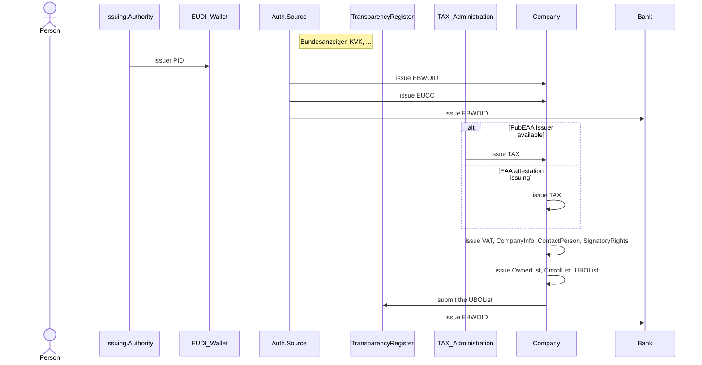

### 1. Scenario 1 

### 1.1. Legal Entity Selection
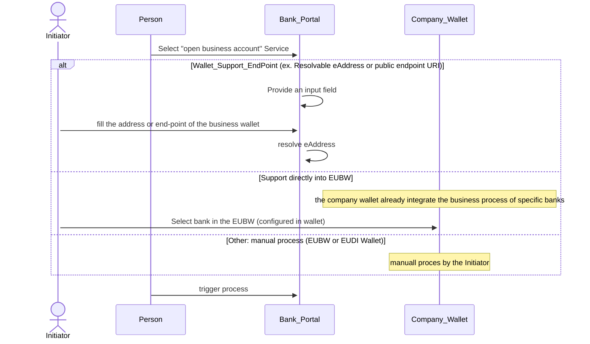

### 1.2. Initiator Identification 
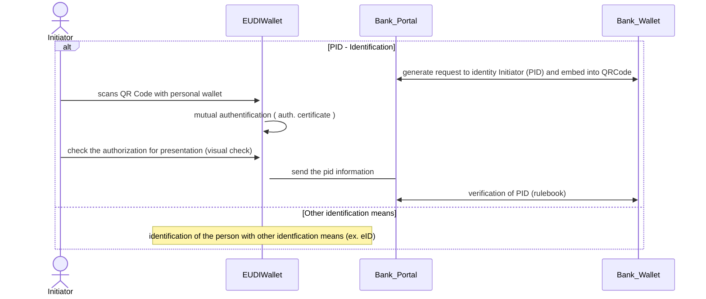

### 1.3. LegalEntity-Base Identification

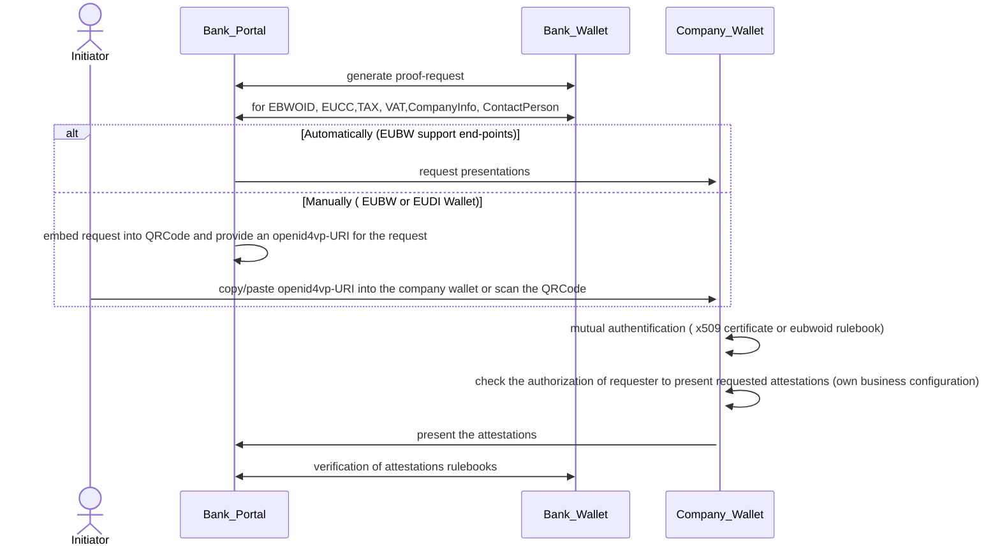

### 1.4. Initiator Authorization

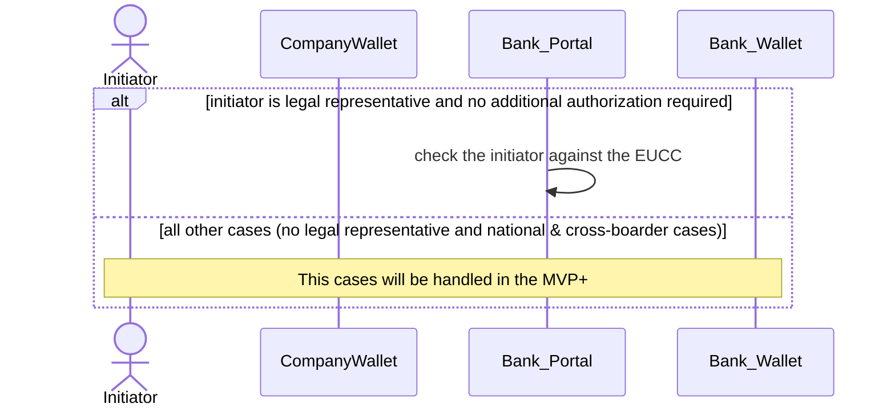

### 1.5. KYC - Customer Due Diligence Information

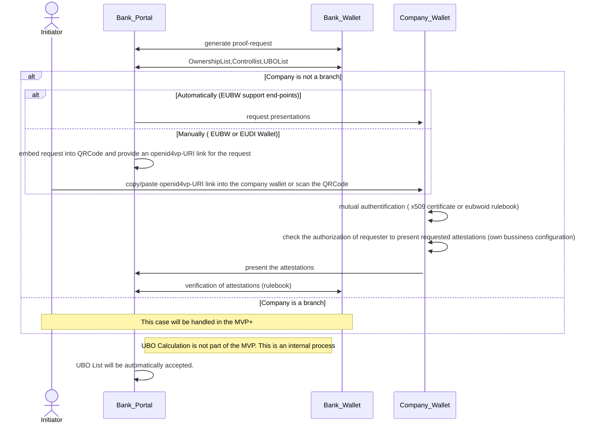

### 1.6. Signatory Rights and UBOList from Transparency Register

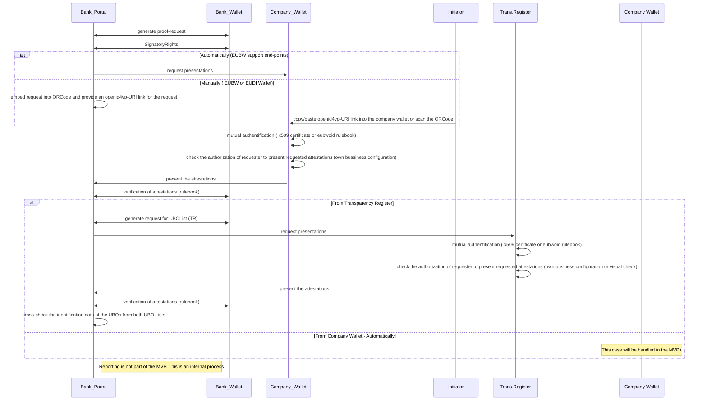

### 1.7. UBOs Verification 

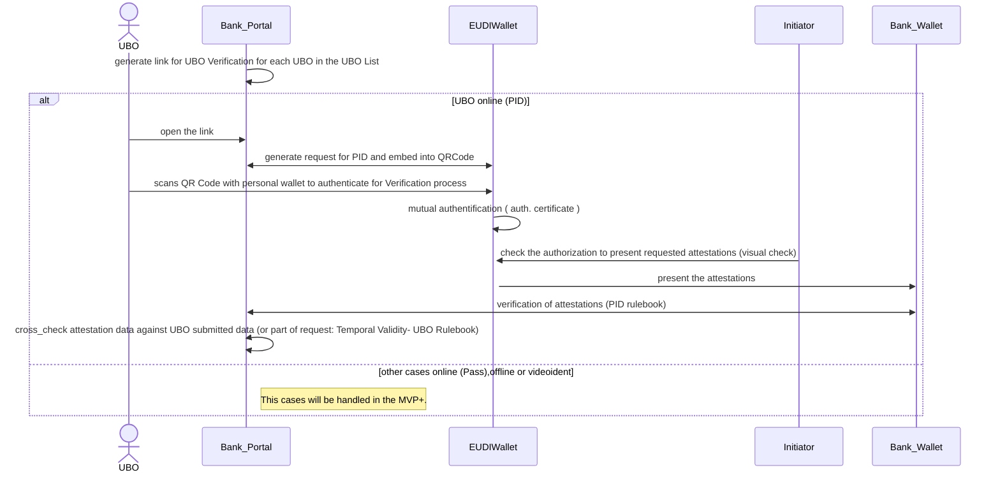

### 1.8. Sanction check (this will be handled in the MVP+)
* This will be handled in the MVP+

### 1.9 Cross-Check  
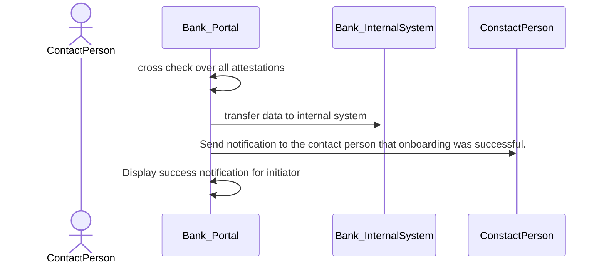

### 2. Scenario 2

### 2.1. Contract signing 

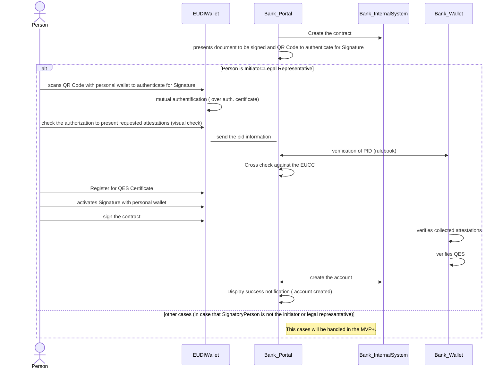

### 3. Scenario 3

### 3.1. Onboarding process (for future access of bank services)
This will be handled in the MVP+

### 3.2. IBAN Issuing

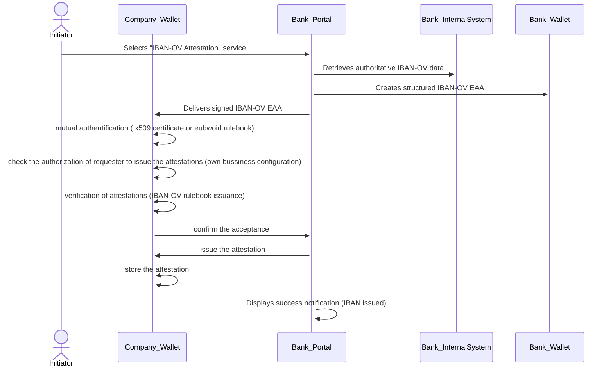

