# PA3 MVP+ Workflow

MVP Restrictions:

- no restriction in regard to initiator, legal repr and ubo list  
- no restriction in regard to signatory rights
- no restriction in regard to IBAN request (wih delay)
- Mutual authentication is default true (no TLOL or device binding checks applied).
- The company is authorized to present the credential and receive attestation
- The company is a branch
- The company is risk-related company (sanction list check is required)

## Pre-requisites
This are the Pre-requisites for the company and bank in order to run the MVP.

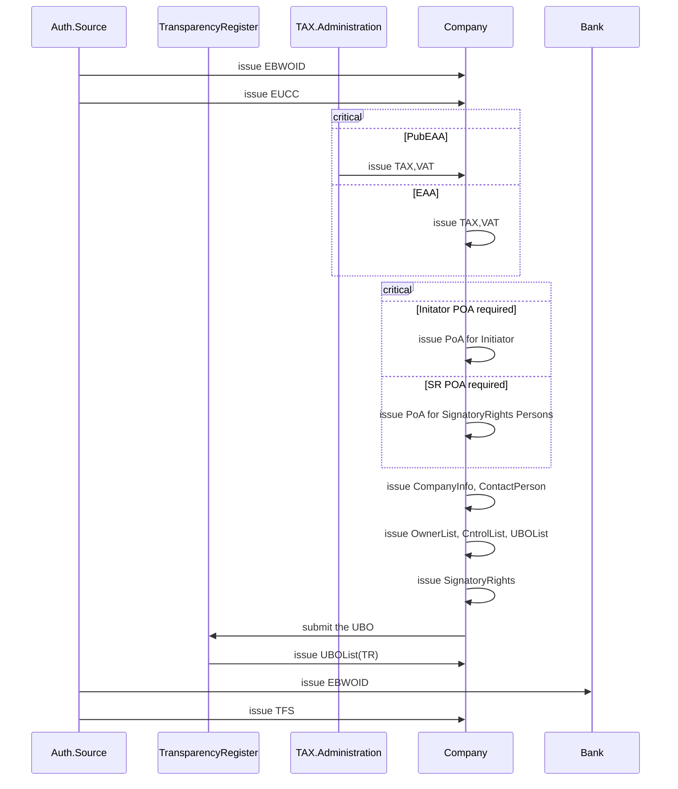

### 1. Scenario 1

### 1.1. Legal Entity Selection
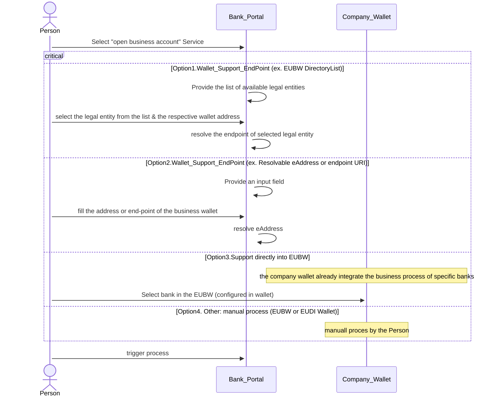

### 1.2. Initiator Identification
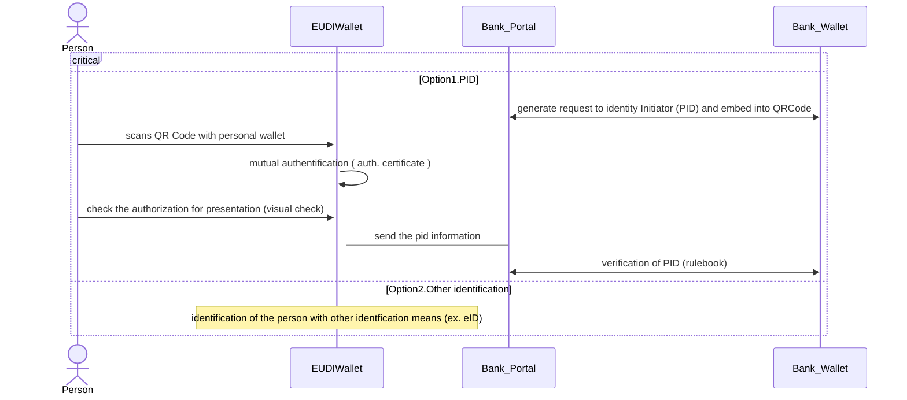

### 1.3. LegalEntity Identification

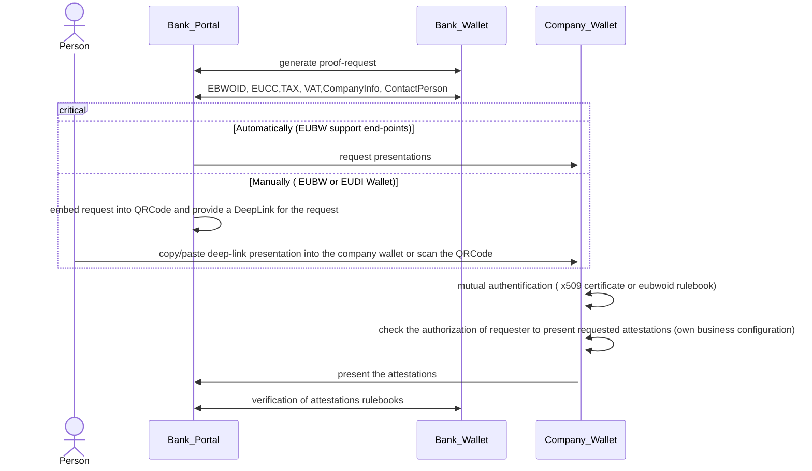

### 1.4. Initiator Authorization

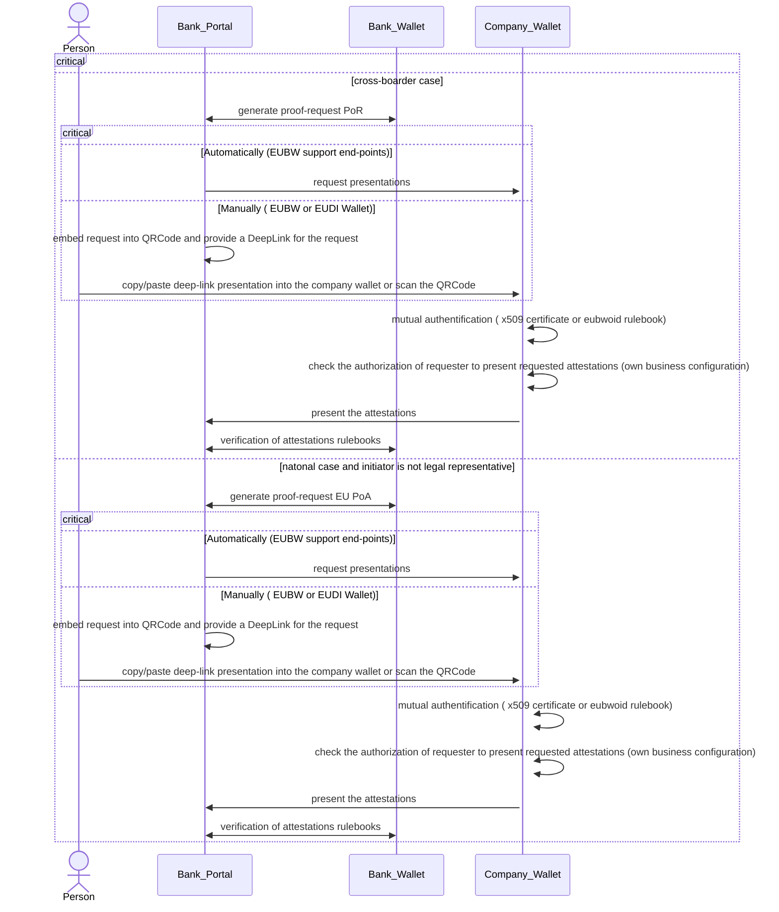

### 1.5. Additionally KYC information

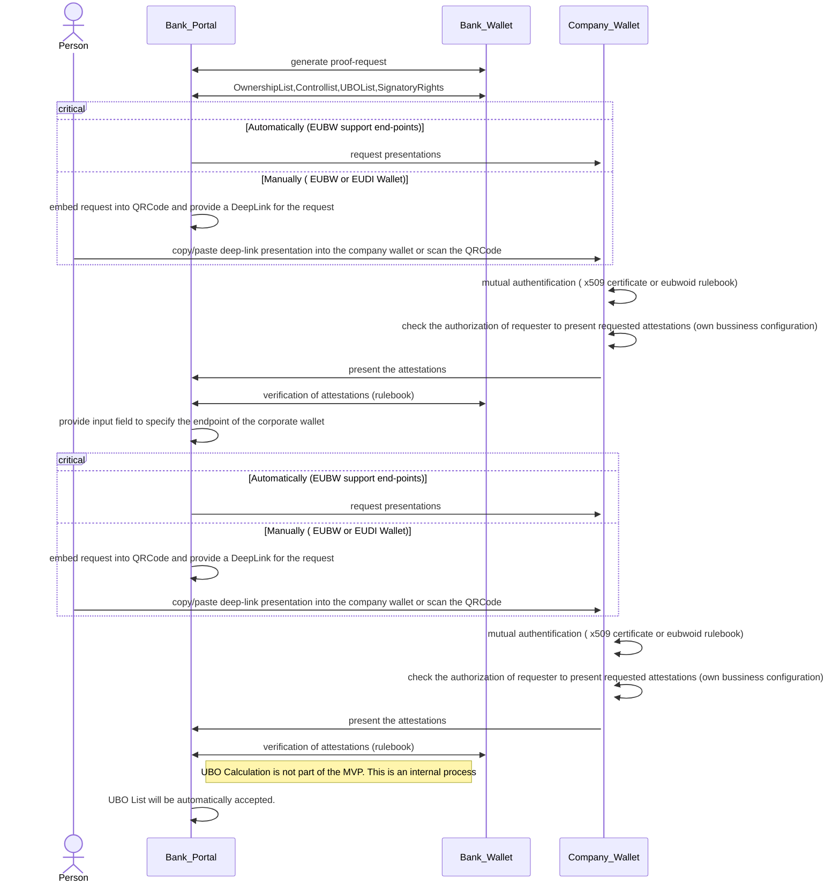

### 1.6. UBOList from Transparency Register

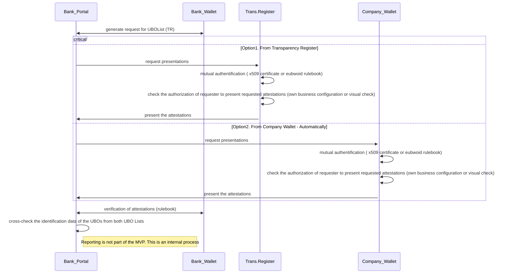

### 1.7. UBOs Verification
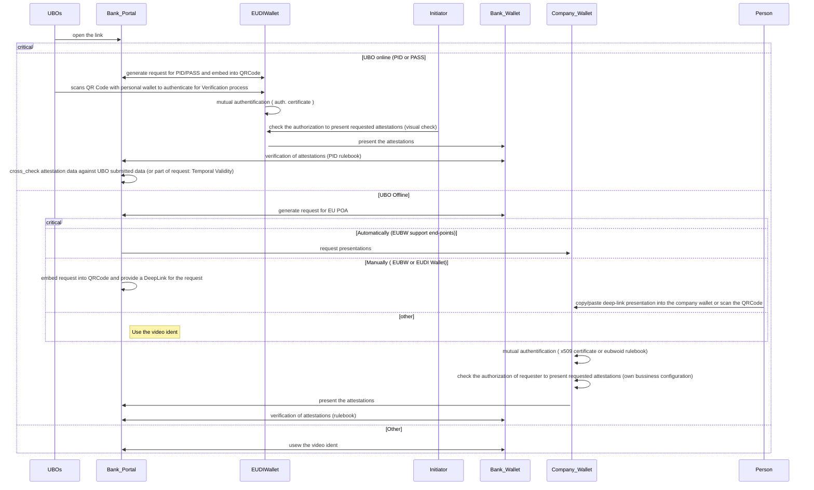

### 1.8. Sanction check 

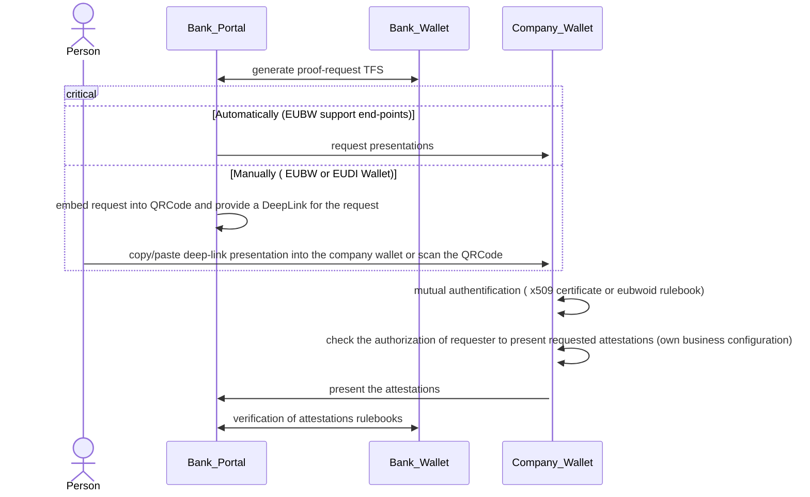

### 1.9. Cross-Check
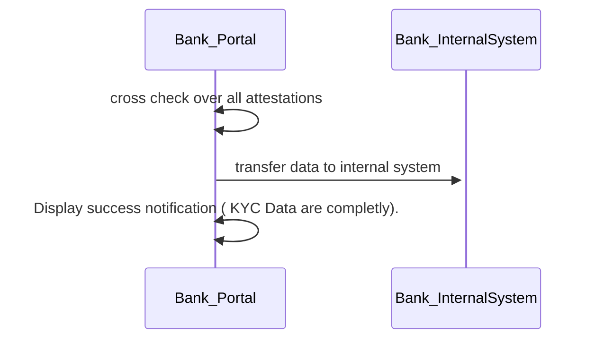

### 2. Scenario 2

### 2.1. Contract signing

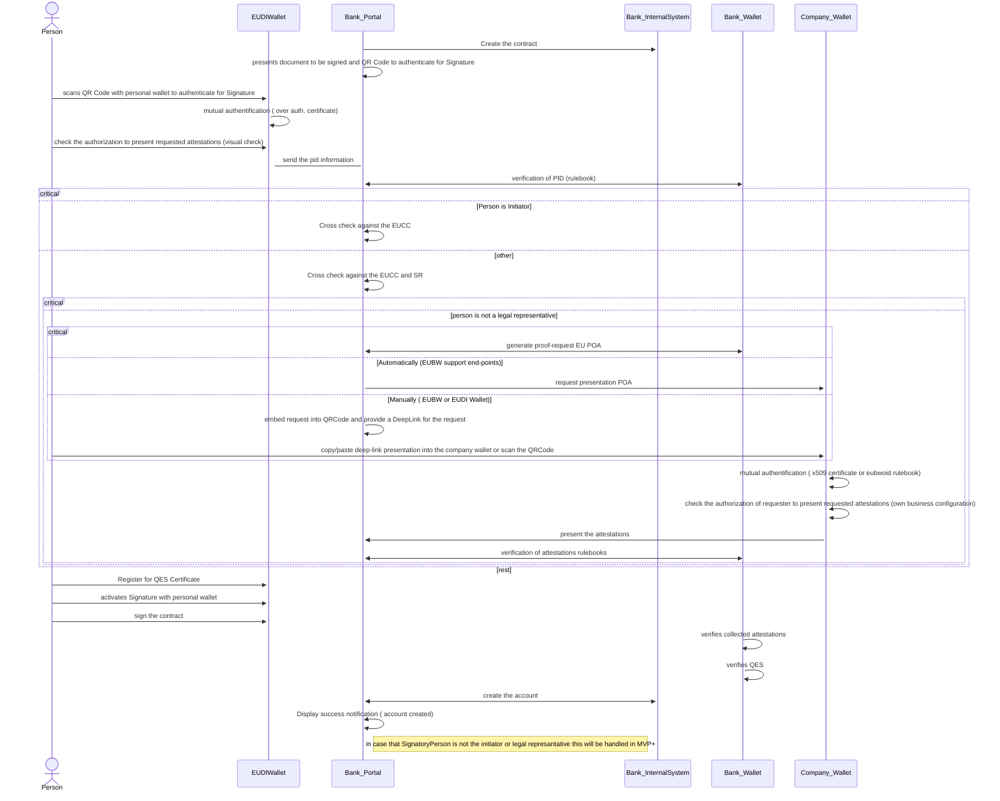

### 3. Scenario 3

### 3.1. Onboarding process (this will be handled in the MVP+)

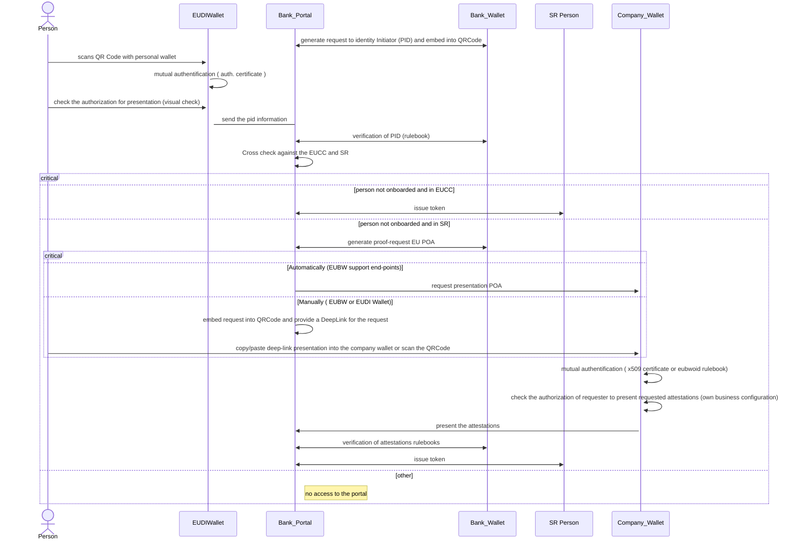

### 3.2. IBAN Issuing

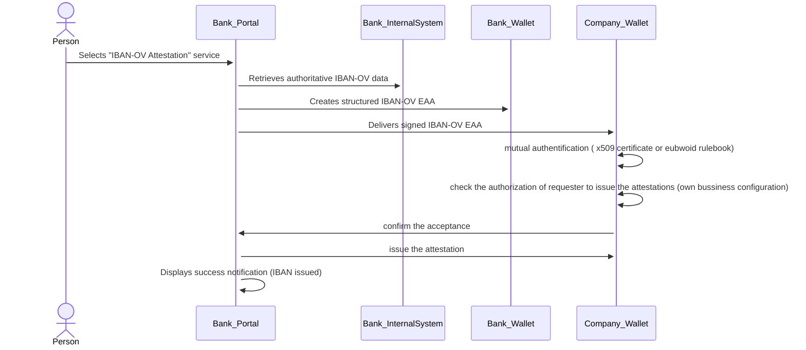
