# PA3 MVP+ Workflow

MVP+ coverage

## General Use Case Assumptions
- The scenario is executed across multiple steps involving multiple persons.
- Cross-border is part of the scenario
- The registration in the national register for special banks ( still in discussion)
- The process concludes with:
  - Issuance of the IBAN-OV QEAA into the Enterprise Business Wallet (EBW)
  - SCA credentials issued to the acting person for future processes
- Open point: Assessment required whether QSeal alone is sufficient for contract signing.

## Company Perspective (Holder)
- The initiator is not registered in any registry (no EUCC).
- The MVP+ process involves multiple persons 
  - Minimum 2 Legal Representatives:
    - One Legal Representative registered in EUCC
    - One Legal Representative with POA only
  - Minimum 2 UBOs:
    - UBO 1: registered in both transparency register and EUCC → offline onboarding (no EUDI wallet, POA + supporting evidence)
    - UBO 2: not registered in transparency register ("fictive UBO") → offline onboarding (no EUDI wallet, VideoIdent)
  - Minimum 2 persons from signatory rights: 
    - Sign the contracts  
    - Access the bank services (IBAN Issuing)
- UBO identification & verification supports online, offline and VideoIdent methods (as reference)
- The company operates as a branch in another country.
- Default signing method: QES and minimum of 2 signatories required: one Legal Representative and one person from SignartoryRights with POA

## Bank Perspective (Relying Party)
- Company Onboarding 
  - Cross-border onboarding without mandatory registrations in the national register will be supported.
  - Onboarding of the sub-siadiary supported and requesting the share holder information from main company ( other country)
  - Authorization of representatives and signatories will be supported. 
  - UBO Verification supported ( online and offline)
  - KYC Base sanctions screening will be supported High-risk client classification
- Contract signing 
  - support according to the company regstration information 
  - support of person with SR and respective POA)
  - open still under discussion — assessment required whether QSeal alone is sufficient for contract signing.
- IBAN-OV Issuance 
  - The IBAN issuance process is executed at a different point in time than the initiator onboarding process.
  - support of triggering for a person who is not the initiator but is defined in the business rules under signatory rights and have the respectice poa 
  - This person wil be onboarded by the bank and receives SCA for future (SCA) credentials for future processes.
  - The person can select IBAN to be  issued as a EAA or QEAA
  - Delivered will be directly into the Enterprise Business Wallet (EBW)

## Person Perspective (EUDI Wallet)
- The natural persons acting on behalf of the legal entity holds a valid EUDI Wallet containing a PID credential.
- Multiple persons are involved in the process, each acting at different points in time:
- Initiator (not registered in any registry)
- Legal Representatives (min. 2)
- UBOs (min. 2,minimum one with EUDI Wallet and one without EUDI wallet)
- Person which will sign the contract 
- Person which will access the bank service ( IBAN issuing )

## Assumptions — Holder Business Wallet
- The process involves multiple holders (initiator, legal representatives, UBOs) acting at different points in time.
- Offline onboarding paths (no EUDI wallet) must be supported for:
- Automatic Flow:
 - Mutual authentication is enabled by default; no TLOL or device-binding checks are applied. 
 - The company wallet is pre-authorized to both present and receive attestations; no additional configuration is supported in MVP+.
 - The Business Wallet accepts credential offers automatically when an active corporate authorisation session is already established.
- Manual Flow:
 - Mutual authentication is reduced to a visual verification step.
 - Authorization is reduced to a visual check and manual approval process.

## Assumptions — Relying Party Business Wallet
- Attestation verification for attestations will be limit to 
  - for QEAA	
    - Cryptographic validation (Section 4.2.1)
    - Issuer identification against internal trusted list (Sections 4.2.2–4.2.3) or TLOL (based on Wallet Provider readniess) 
  - for EAA 
    - Cryptographic validation (Section 4.2.1)
    - Basic issuer identification against internal trusted list (Sections 4.2.2–4.2.3)

## Pre-requisites
This are the Pre-requisites for the company and bank in order to run the MVP.

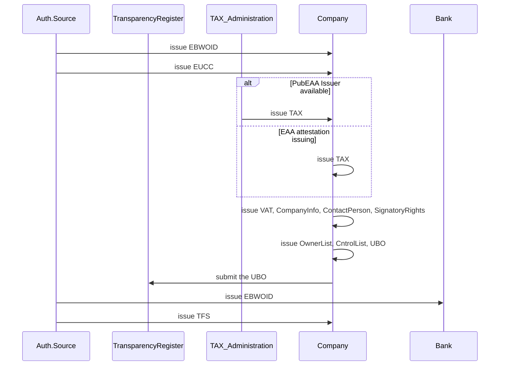
```mermaid
sequenceDiagram
    participant Auth.Source
    participant TransparencyRegister
    participant TAX_Administration 
    participant Company
    participant Bank 
    Auth.Source ->> Company : issue EBWOID  
    Auth.Source ->> Company : issue EUCC
    alt PubEAA Issuer available
        TAX_Administration ->> Company : issue TAX
    else EAA attestation issuing
        Company ->> Company: issue TAX
    end
    Company ->> Company: issue VAT, CompanyInfo, ContactPerson, SignatoryRights
    Company ->> Company: issue OwnerList, CntrolList, UBO
    Company ->> TransparencyRegister: submit the UBO 
    Auth.Source ->> Bank : issue EBWOID
    Auth.Source ->> Company : issue TFS 
```

### 1. Scenario 1

### 1.1. Legal Entity Selection
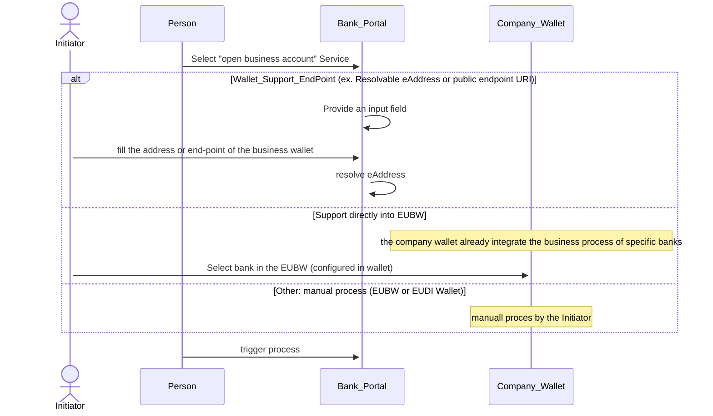
```mermaid
sequenceDiagram
    actor Initiator
    activate Initiator
    Person->>+Bank_Portal: Select "open business account" Service
    alt Wallet_Support_EndPoint (ex. Resolvable eAddress or public endpoint URI)
        Bank_Portal->>+Bank_Portal : Provide an input field
        Initiator->>+Bank_Portal: fill the address or end-point of the business wallet
        Bank_Portal->>+Bank_Portal: resolve eAddress
    else Support directly into EUBW  
        Note over Company_Wallet: the company wallet already integrate the business process of specific banks
        Initiator->>+Company_Wallet: Select bank in the EUBW (configured in wallet)
    else Other: manual process (EUBW or EUDI Wallet)
        Note over Company_Wallet: manuall proces by the Initiator
    end
    Person->>+Bank_Portal: trigger process
```

### 1.2. Initiator Identification
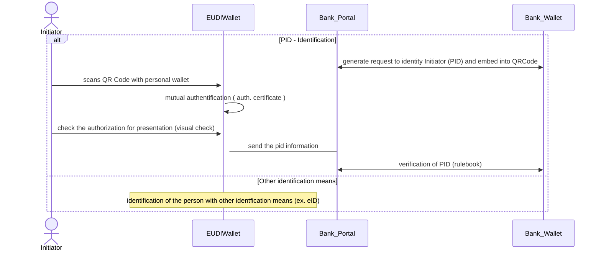
```mermaid
sequenceDiagram
    actor Initiator
    participant EUDIWallet
    alt PID - Identification
        Bank_Portal<<->>Bank_Wallet: generate request to identity Initiator (PID) and embed into QRCode
        Initiator->>+EUDIWallet : scans QR Code with personal wallet
        EUDIWallet->>+EUDIWallet : mutual authentification ( auth. certificate )
        Initiator->>+EUDIWallet : check the authorization for presentation (visual check)
        EUDIWallet->Bank_Portal : send the pid information
        Bank_Portal<<->>Bank_Wallet: verification of PID  (rulebook)
    else Other identification means
        Note over EUDIWallet: identification of the person with other identfication means (ex. eID)
    end
```

### 1.3. LegalEntity Identification

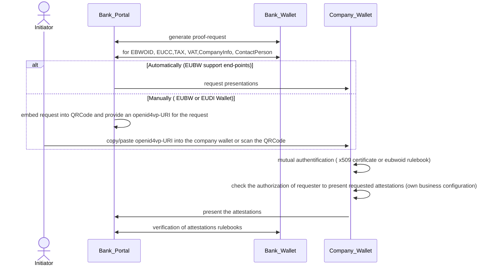
```mermaid
sequenceDiagram
    actor Initiator
    Bank_Portal<<->>Bank_Wallet: generate proof-request
    Bank_Portal<<->>Bank_Wallet: for EBWOID, EUCC,TAX, VAT,CompanyInfo, ContactPerson
    alt Automatically (EUBW support end-points)
        Bank_Portal->>+Company_Wallet: request presentations 
    else Manually ( EUBW or EUDI Wallet)
        Bank_Portal->>Bank_Portal: embed request into QRCode and provide an openid4vp-URI for the request
        Initiator->>+Company_Wallet: copy/paste openid4vp-URI into the company wallet or scan the QRCode
    end
    Company_Wallet<<->>Company_Wallet: mutual authentification ( x509 certificate or eubwoid rulebook)
    Company_Wallet<<->>Company_Wallet: check the authorization of requester to present requested attestations (own business configuration)
    Company_Wallet->>Bank_Portal: present the attestations
    Bank_Portal<<->>Bank_Wallet: verification of attestations rulebooks
```

### 1.4. Initiator Authorization

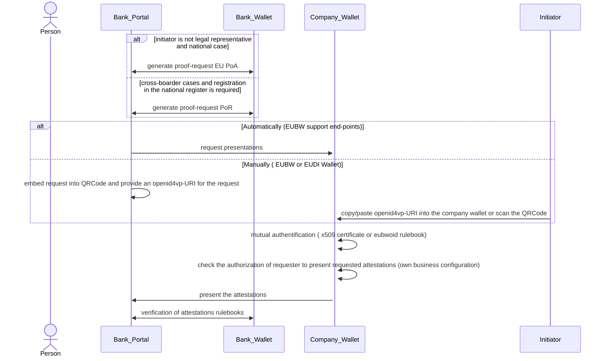
```mermaid
sequenceDiagram
    actor Person
    alt initiator is not legal representative and national case
        Bank_Portal<<->>Bank_Wallet: generate proof-request EU PoA
    else cross-boarder cases and registration in the national register is required
        Bank_Portal<<->>Bank_Wallet: generate proof-request PoR
    end   
    
    alt  Automatically (EUBW support end-points)
        Bank_Portal->>+Company_Wallet: request presentations
    else  Manually ( EUBW or EUDI Wallet)
        Bank_Portal->>Bank_Portal: embed request into QRCode and provide an openid4vp-URI for the request
        Initiator->>+Company_Wallet: copy/paste openid4vp-URI into the company wallet or scan the QRCode
    end
    Company_Wallet<<->>Company_Wallet: mutual authentification ( x509 certificate or eubwoid rulebook)
    Company_Wallet<<->>Company_Wallet: check the authorization of requester to present requested attestations (own business configuration)
    Company_Wallet->>Bank_Portal: present the attestations
    Bank_Portal<<->>Bank_Wallet: verification of attestations rulebooks
    
```

### 1.5. Ownership & Control Structure Information

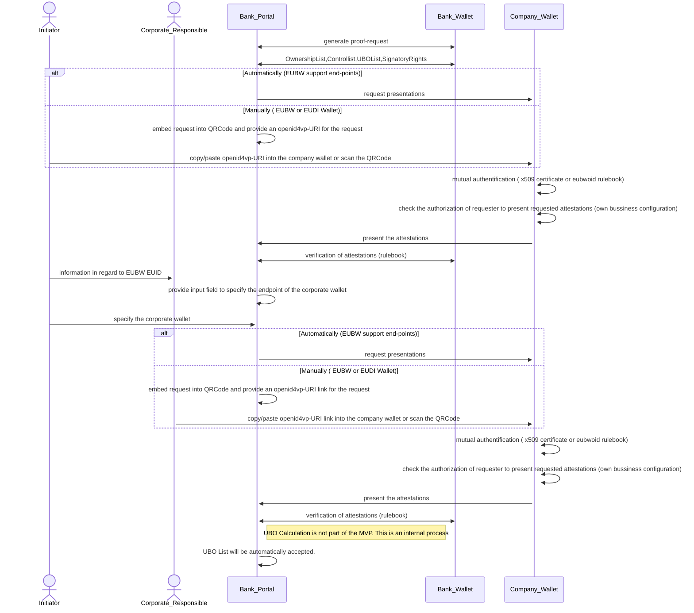
```mermaid
sequenceDiagram
    actor Initiator
    actor Corporate_Responsible
    Bank_Portal<<->>Bank_Wallet: generate proof-request
    Bank_Portal<<->>Bank_Wallet: OwnershipList,Controllist,UBOList,SignatoryRights
    alt Automatically (EUBW support end-points)
        Bank_Portal->>+Company_Wallet: request presentations
    else Manually ( EUBW or EUDI Wallet)
        Bank_Portal->>Bank_Portal: embed request into QRCode and provide an openid4vp-URI for the request
        Initiator->>+Company_Wallet: copy/paste openid4vp-URI into the company wallet or scan the QRCode
    end
    Company_Wallet<<->>Company_Wallet: mutual authentification ( x509 certificate or eubwoid rulebook)
    Company_Wallet<<->>Company_Wallet: check the authorization of requester to present requested attestations (own bussiness configuration)
    Company_Wallet->>Bank_Portal: present the attestations
    Bank_Portal<<->>Bank_Wallet: verification of attestations (rulebook)
    
    Initiator->>+Corporate_Responsible : information in regard to EUBW EUID 
    
    Bank_Portal->>Bank_Portal: provide input field to specify the endpoint of the corporate wallet
    Initiator->>+Bank_Portal: specify the corporate wallet
    alt Automatically (EUBW support end-points)
        Bank_Portal->>+Company_Wallet: request presentations
    else Manually ( EUBW or EUDI Wallet)
        Bank_Portal->>Bank_Portal: embed request into QRCode and provide an openid4vp-URI link for the request
        Corporate_Responsible->>+Company_Wallet: copy/paste openid4vp-URI link into the company wallet or scan the QRCode
    end
    Company_Wallet<<->>Company_Wallet: mutual authentification ( x509 certificate or eubwoid rulebook)
    Company_Wallet<<->>Company_Wallet: check the authorization of requester to present requested attestations (own bussiness configuration)
    Company_Wallet->>Bank_Portal: present the attestations
    Bank_Portal<<->>Bank_Wallet: verification of attestations (rulebook)
    
    Note right of Bank_Portal: UBO Calculation is not part of the MVP. This is an internal process
    Bank_Portal->>Bank_Portal: UBO List will be automatically accepted.
```

### 1.6. UBOList from Transparency Register

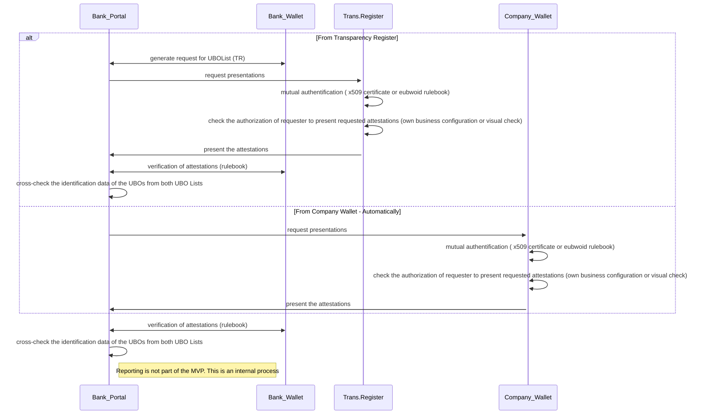
```mermaid
sequenceDiagram
    alt From Transparency Register
        Bank_Portal<<->>Bank_Wallet: generate request for UBOList (TR)
        Bank_Portal->>+Trans.Register: request presentations
        Trans.Register<<->>Trans.Register: mutual authentification ( x509 certificate or eubwoid rulebook)
        Trans.Register<<->>Trans.Register: check the authorization of requester to present requested attestations (own business configuration or visual check)
        Trans.Register->>Bank_Portal: present the attestations
        Bank_Portal<<->>Bank_Wallet: verification of attestations (rulebook)
        Bank_Portal->>Bank_Portal: cross-check the identification data of the UBOs from both UBO Lists
    else From Company Wallet - Automatically
        Bank_Portal->>+Company_Wallet: request presentations
        Company_Wallet<<->>Company_Wallet: mutual authentification ( x509 certificate or eubwoid rulebook)
        Company_Wallet<<->>Company_Wallet: check the authorization of requester to present requested attestations (own business configuration or visual check)
        Company_Wallet->>Bank_Portal: present the attestations
    end 
    Bank_Portal<<->>Bank_Wallet: verification of attestations (rulebook)
    Bank_Portal->>Bank_Portal: cross-check the identification data of the UBOs from both UBO Lists
    Note right of Bank_Portal: Reporting is not part of the MVP. This is an internal process
```

### 1.7. UBOs Verification
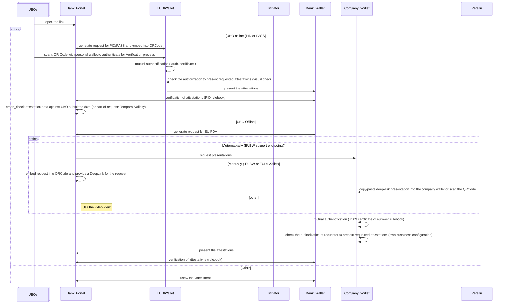
```mermaid
sequenceDiagram
    participant UBOs@{ "type" : "collections" }
    UBOs->>Bank_Portal: open the link
    critical
        option UBO online (PID or PASS
            Bank_Portal<<->>EUDIWallet: generate request for PID/PASS and embed into QRCode
            UBOs->>EUDIWallet: scans QR Code with personal wallet to authenticate for Verification process
            EUDIWallet->>+EUDIWallet : mutual authentification ( auth. certificate )
            Initiator->>+EUDIWallet : check the authorization to present requested attestations (visual check)
            EUDIWallet->>Bank_Wallet: present the attestations
            Bank_Portal<<->>Bank_Wallet: verification of attestations (PID rulebook)
            Bank_Portal<<->>Bank_Portal: cross_check attestation data against UBO submitted data (or part of request: Temporal Validity)
        option UBO Offline 
            Bank_Portal<<->>Bank_Wallet: generate request for EU POA 
            critical 
                option Automatically (EUBW support end-points)
                    Bank_Portal->>+Company_Wallet: request presentations
                option Manually ( EUBW or EUDI Wallet)
                    Bank_Portal->>Bank_Portal: embed request into QRCode and provide a DeepLink for the request
                    Person->>+Company_Wallet: copy/paste deep-link presentation into the company wallet or scan the QRCode
                option other
                    Note right of Bank_Portal: Use the video ident
            end 
            Company_Wallet<<->>Company_Wallet: mutual authentification ( x509 certificate or eubwoid rulebook)
            Company_Wallet<<->>Company_Wallet: check the authorization of requester to present requested attestations (own bussiness configuration)
            Company_Wallet->>Bank_Portal: present the attestations
            Bank_Portal<<->>Bank_Wallet: verification of attestations (rulebook)
        option Other 
             Bank_Portal<<->>Bank_Wallet: usew the video ident
    end
```

### 1.8. Sanction check 

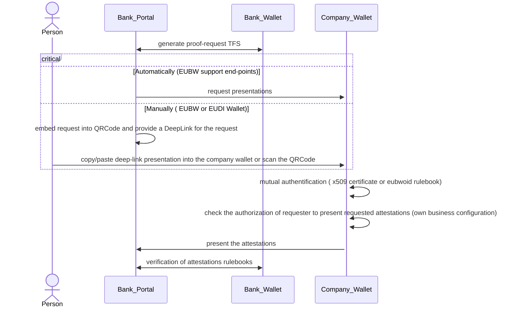
```mermaid
sequenceDiagram
    actor Person
    Bank_Portal<<->>Bank_Wallet: generate proof-request TFS 
    critical
    option Automatically (EUBW support end-points)
        Bank_Portal->>+Company_Wallet: request presentations
    option Manually ( EUBW or EUDI Wallet)
        Bank_Portal->>Bank_Portal: embed request into QRCode and provide a DeepLink for the request
        Person->>+Company_Wallet: copy/paste deep-link presentation into the company wallet or scan the QRCode
    end
    Company_Wallet<<->>Company_Wallet: mutual authentification ( x509 certificate or eubwoid rulebook)
    Company_Wallet<<->>Company_Wallet: check the authorization of requester to present requested attestations (own business configuration)
    Company_Wallet->>Bank_Portal: present the attestations
    Bank_Portal<<->>Bank_Wallet: verification of attestations rulebooks
```

### 1.9. Cross-Check
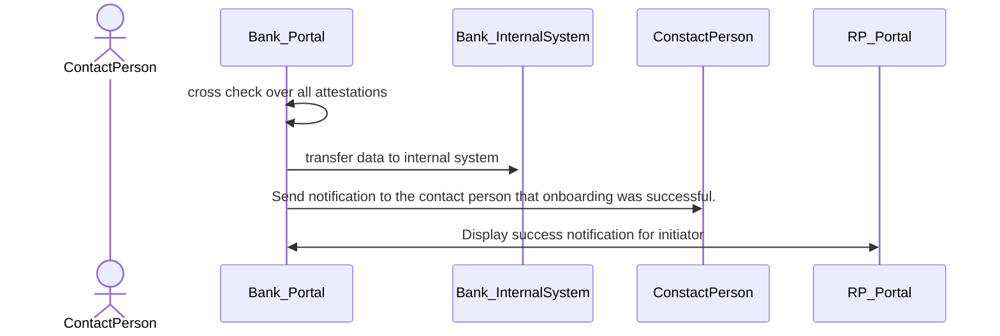
```mermaid
sequenceDiagram
    actor ContactPerson 
    Bank_Portal<<->>Bank_Portal: cross check over all attestations 
    Bank_Portal->>+Bank_InternalSystem: transfer data to internal system

    Bank_Portal->>ConstactPerson: Send notification to the contact person that onboarding was successful.
    Bank_Portal<<->>RP_Portal: Display success notification for initiator
```

### 2. Scenario 2

### 2.1. Contract signing

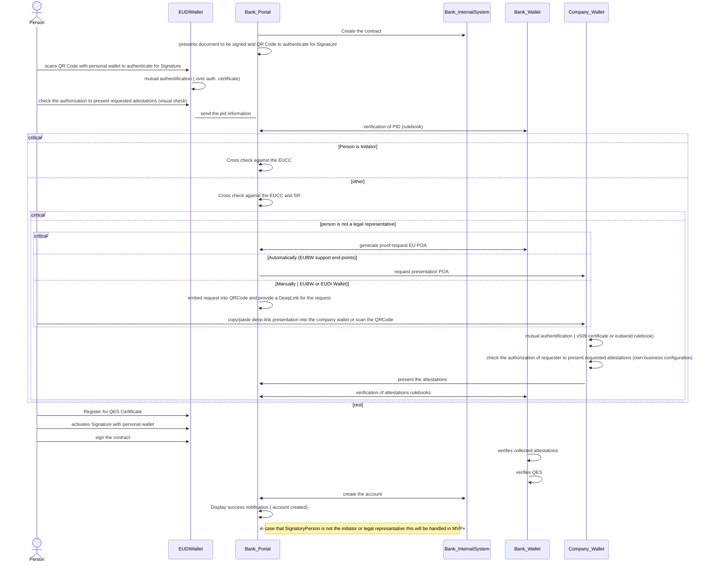
```mermaid
sequenceDiagram
    actor Person
    participant EUDIWallet

    Bank_Portal->>+Bank_InternalSystem: Create the contract
    Bank_Portal->>+Bank_Portal: presents document to be signed and QR Code to authenticate for Signature
    Person ->>+EUDIWallet: scans QR Code with personal wallet to authenticate for Signature
    EUDIWallet->>+EUDIWallet:  mutual authentification ( over auth. certificate)
    Person->>+EUDIWallet : check the authorization to present requested attestations (visual check)
    EUDIWallet->Bank_Portal : send the pid information
    Bank_Portal<<->>Bank_Wallet: verification of PID  (rulebook)

    critical 
        option Person is Initiator
            Bank_Portal<<->>Bank_Portal: Cross check against the EUCC
        option other
            Bank_Portal<<->>Bank_Portal: Cross check against the EUCC and SR 
            critical 
                option person is not a legal representative 
                    critical 
                    Bank_Portal<<->>Bank_Wallet: generate proof-request EU POA  
                    option Automatically (EUBW support end-points)
                        Bank_Portal->>+Company_Wallet: request presentation POA 
                    option Manually ( EUBW or EUDI Wallet)
                        Bank_Portal->>Bank_Portal: embed request into QRCode and provide a DeepLink for the request
                        Person->>+Company_Wallet: copy/paste deep-link presentation into the company wallet or scan the QRCode
                    end
                    Company_Wallet<<->>Company_Wallet: mutual authentification ( x509 certificate or eubwoid rulebook)
                    Company_Wallet<<->>Company_Wallet: check the authorization of requester to present requested attestations (own business configuration)
                    Company_Wallet->>Bank_Portal: present the attestations
                    Bank_Portal<<->>Bank_Wallet: verification of attestations rulebooks                    
                option rest     
            end
    end

    Person ->>+EUDIWallet: Register for QES Certificate
    Person ->>+EUDIWallet: activates Signature with personal wallet
    Person ->>+EUDIWallet: sign the contract

    Bank_Wallet->>+Bank_Wallet: verifies collected attestations
    Bank_Wallet->>+Bank_Wallet: verifies QES
    Bank_Portal<<->>+Bank_InternalSystem : create the account
    Bank_Portal<<->>Bank_Portal: Display success notification ( account created)
    Note right of Bank_Portal: in case that SignatoryPerson is not the initiator or legal represantative this will be handled in MVP+
```

### 3. Scenario 3

### 3.1. Onboarding process

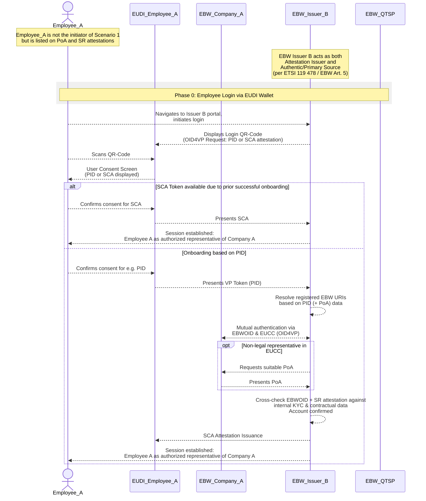
```mermaid
sequenceDiagram
    
    actor Employee_A
    participant EUDI_Employee_A
    note over Employee_A: Employee_A is not the initiator of Scenario 1<br/>but is listed on PoA and SR attestations
    participant EBW_Company_A
    participant EBW_Issuer_B
    note over EBW_Issuer_B: EBW Issuer B acts as both<br/>Attestation Issuer and<br/>Authentic/Primary Source<br/>(per ETSI 119 478 / EBW Art. 5)
    participant EBW_QTSP

    rect rgb(240, 240, 240)
        note over Employee_A, EBW_QTSP: Phase 0: Employee Login via EUDI Wallet
    end 
        Employee_A -->> EBW_Issuer_B: Navigates to Issuer B portal,<br/>initiates login
        EBW_Issuer_B -->> EUDI_Employee_A: Displays Login QR-Code<br/>(OID4VP Request: PID or SCA attestation)
        Employee_A -->> EUDI_Employee_A: Scans QR-Code
        EUDI_Employee_A -->> Employee_A: User Consent Screen<br/>(PID or SCA displayed)

        alt SCA Token available due to prior successful onboarding
            Employee_A -->> EUDI_Employee_A: Confirms consent for SCA
            EUDI_Employee_A -->> EBW_Issuer_B: Presents SCA
            EBW_Issuer_B -->> Employee_A: Session established:<br/>Employee A as authorized representative of Company A
        else Onboarding based on PID
            Employee_A -->> EUDI_Employee_A: Confirms consent for e.g. PID
            EUDI_Employee_A -->> EBW_Issuer_B: Presents VP Token (PID)
            EBW_Issuer_B -->> EBW_Issuer_B: Resolve registered EBW URIs<br/>based on PID (+ PoA) data
            EBW_Issuer_B <<-->> EBW_Company_A: Mutual authentication via<br/>EBWOID & EUCC (OID4VP)

            opt Non-legal representative in EUCC
                EBW_Issuer_B -->> EBW_Company_A: Requests suitable PoA
                EBW_Company_A -->> EBW_Issuer_B: Presents PoA
            end

            EBW_Issuer_B -->> EBW_Issuer_B: Cross-check EBWOID + SR attestation against<br/>internal KYC & contractual data<br/>Account confirmed
            EBW_Issuer_B -->> EUDI_Employee_A: SCA Attestation Issuance
            EBW_Issuer_B -->> Employee_A: Session established:<br/>Employee A as authorized representative of Company A
        end
     
```

### 3.2. Service Selection and IBAN Issuing

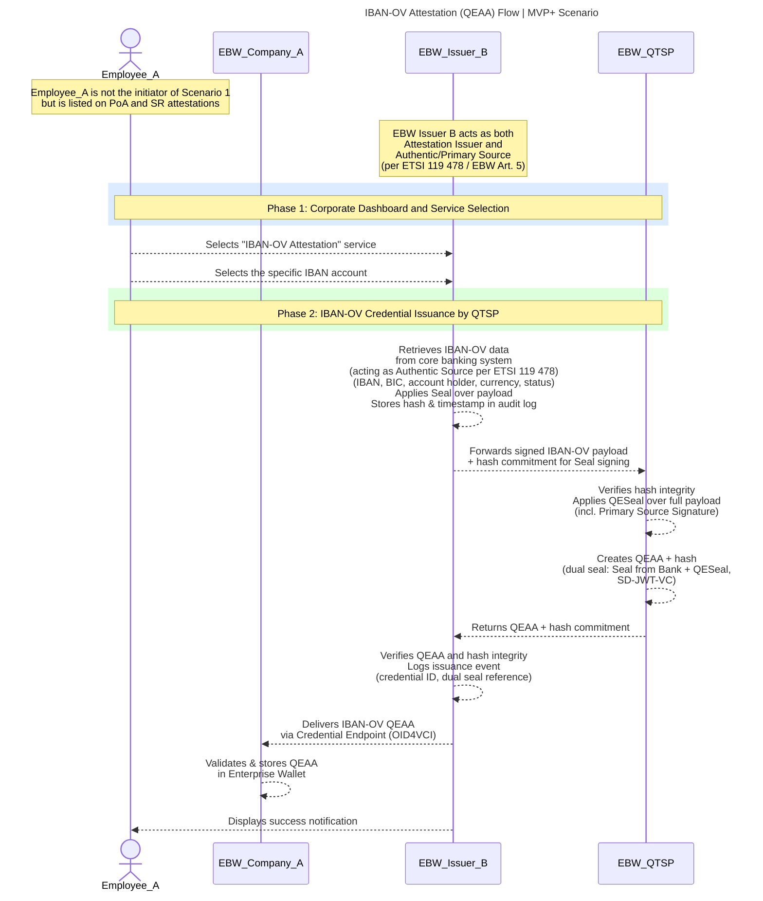
```mermaid
sequenceDiagram
    title IBAN-OV Attestation (QEAA) Flow | MVP+ Scenario

    actor Employee_A
    note over Employee_A: Employee_A is not the initiator of Scenario 1<br/>but is listed on PoA and SR attestations
    participant EBW_Company_A
    participant EBW_Issuer_B
    note over EBW_Issuer_B: EBW Issuer B acts as both<br/>Attestation Issuer and<br/>Authentic/Primary Source<br/>(per ETSI 119 478 / EBW Art. 5)
    participant EBW_QTSP
    
    rect rgb(220, 235, 255)
        note over Employee_A, EBW_QTSP: Phase 1: Corporate Dashboard and Service Selection
    end
        Employee_A -->> EBW_Issuer_B: Selects "IBAN-OV Attestation" service
        Employee_A -->> EBW_Issuer_B: Selects the specific IBAN account
    
    rect rgb(220, 255, 220)
        note over Employee_A, EBW_QTSP: Phase 2: IBAN-OV Credential Issuance by QTSP
    end
        EBW_Issuer_B -->> EBW_Issuer_B: Retrieves IBAN-OV data<br/>from core banking system<br/>(acting as Authentic Source per ETSI 119 478)<br/>(IBAN, BIC, account holder, currency, status)<br/>Applies Seal over payload<br/>Stores hash & timestamp in audit log

        EBW_Issuer_B -->> EBW_QTSP: Forwards signed IBAN-OV payload<br/>+ hash commitment for Seal signing

        EBW_QTSP -->> EBW_QTSP: Verifies hash integrity<br/>Applies QESeal over full payload<br/>(incl. Primary Source Signature)

        EBW_QTSP -->> EBW_QTSP: Creates QEAA + hash<br/>(dual seal: Seal from Bank + QESeal,<br/>SD-JWT-VC)

        EBW_QTSP -->> EBW_Issuer_B: Returns QEAA + hash commitment

        EBW_Issuer_B -->> EBW_Issuer_B: Verifies QEAA and hash integrity<br/>Logs issuance event<br/>(credential ID, dual seal reference)

        EBW_Issuer_B -->> EBW_Company_A: Delivers IBAN-OV QEAA<br/>via Credential Endpoint (OID4VCI)

        EBW_Company_A -->> EBW_Company_A: Validates & stores QEAA<br/>in Enterprise Wallet

        EBW_Issuer_B -->> Employee_A: Displays success notification
    
```
