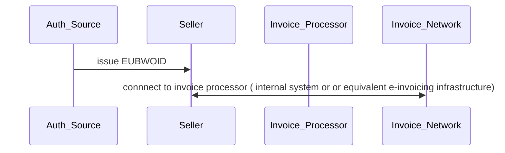
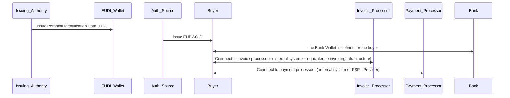
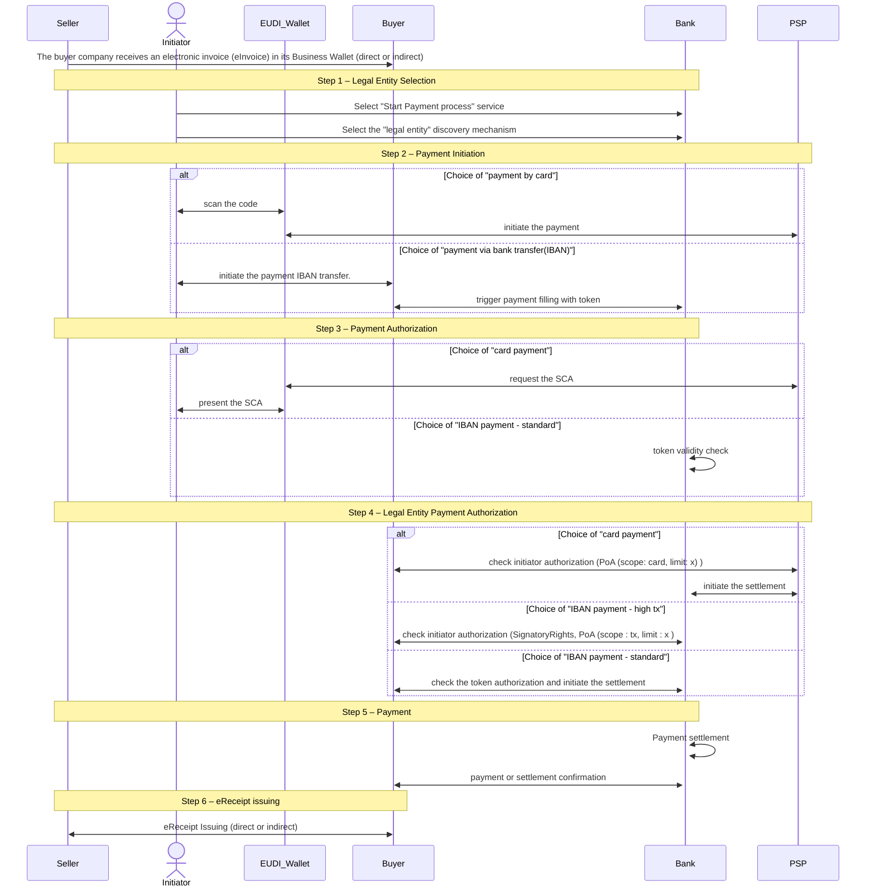

# PA4 MVP Workflow

MVP Restrictions:

## Seller Perspective (Holder)
- The seller has an active European Business Wallet (EUBW) containing only the minimum set of attestations required to execute PA4.
- The seller is not required to complete onboarding with the Home Bank (PA3) or onboarding into the KYS process (BU1 – KYS).

## Buyer Perspective (Relying Party)
- The buyer holds an active European Business Wallet (EUBW) containing only the minimum set of attestations required to execute PA4.
- The buyer is not required to complete onboarding with the Home Bank (PA3) or undergo onboarding into the KYC process (BU1 – KYC).
- The onboarding of the acting person representing the buyer company within the Home Bank is performed as part of the end-customer onboarding process, rather than as a separate business representative onboarding process (covered under PA2).
- Consequently, the buyer’s Business Wallet is assumed to contain valid Authorised Signatory Rights (SR) attestations, together with the corresponding Power of Attorney (PoA) for the acting person.
- In the case of IBAN-based transactions, the IBAN information provided in the eInvoice is assumed to be trusted. 
- The IBAN validation is considered out of scope for the MVP, as the KYS/KYC process is excluded.
- The invoice delivery channel is out of scope for the MVP and covered under SC5.
- Sellers are assumed to be classified exclusively as low- or medium-risk sellers.

## Person Perspective
- The natural person acting on behalf of the legal entity holds a valid EUDI Wallet containing a PID credential.
- It is assumed that the person holds the SCA attestation in the wallet ( PA2 use case). 
- Validation of the company’s authorised representative lists (SR) is out of scope for the MVP.
- The person performs Strong Customer Authentication (SCA) using possession of the wallet device combined with either a PIN or biometric authentication.

## Assumptions – Holder Business Wallet
- Automatic Flow
  - Mutual authentication is enabled by default; no TLOL or device-binding checks are applied.
  - The buyer wallet is pre-authorized to both present and receive attestations; no additional configuration is supported in the MVP.
  - The Business Wallet accepts credential offers automatically when an active corporate authorisation session is already established.

- Manual Flow
  - Mutual authentication is reduced to a visual verification step.
  - Authorization is reduced to a visual check and manual approval process.

## Assumptions – Relying Party Business Wallet
- Attestation verification for each attestation is limited to:
  - Cryptographic validation (Section 4.2.1)
  - Issuer identification against an internal trusted list (Sections 4.2.2-4.3.3)

## General UseCase assumption  
- the payment process is executed sequentially in a single-user flow.
- It is assumed that the eInvoice has already been received in the Business Wallet.
- Cross-border cases is not part of the MVP.
- The process concludes with the issuance of the eReceipt Attestation into the Business Wallet.
- No attestation is issued to the acting person’s EUDI Wallet.

## Pre-requisites
Pre-requisites : These are the pre-requisites for the Seller and  Buyer in order to run the MVP.

1.1 Seller Pre-requisites

1.2 Buyer Pre-requisites

### 1. Scenario 

The following diagram provides an overview of the end-to-end process

