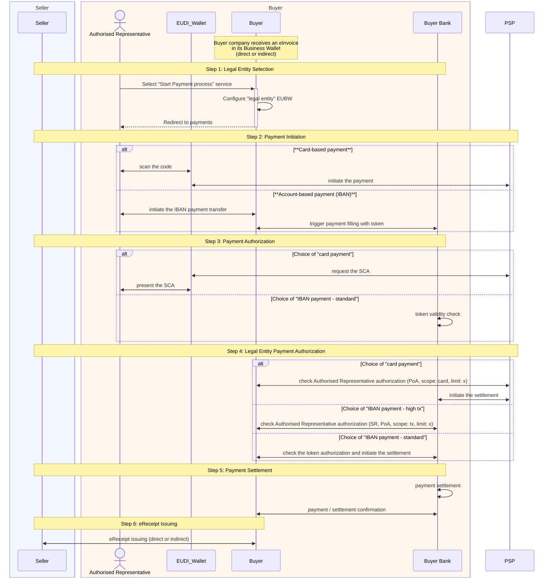

# PA4 MVP: Payment & Receipt Issuance Workflow

| Field        | Value                           |
| ------------ | ------------------------------- |
| Workflow ID  | PA4                             |
| Version      | 0.2 (draft)                     |
| Status       | Draft                           |
| Owner        | PA4 / Florin                    |
| Last updated | 2026-05-22                      |
| Related      | PA2, PA3, BU1-KYS, BU1-KYC, SC5 |

Editors:

- Florin Coptil, Bosch, Germany
- Lal Chandran, iGrant,io, Sweden
- Miriam Weber, Procivis, Switzerland
- Nikos Triantafyllou, UAegean, Greece
- Teemu Varpanen, ReceiptHero, Finland

> **How to read this document.** Sections 1–4 set the stage (what this workflow is, what it covers, who participates, and what the acronyms mean). Sections 5–7 capture the assumptions, prerequisites, and data inputs/outputs that frame the MVP. Section 8 walks through the end-to-end flow, first as a single overview diagram, then step by step. Sections 9–11 close the loop with acceptance criteria, open questions, and references. A new reader can skim §1 → §3 → §8.1 to get the gist in two minutes.

## 1. Purpose

This section states, in a single paragraph, the business outcome the workflow delivers and the rails it relies on. If you read only one section, read this one.

Define the MVP end-to-end flow by which a buyer company pays a received eInvoice and obtains a corresponding eReceipt attestation in its Business Wallet, using either card or IBAN payment rails, with Strong Customer Authentication performed via the Authorised Representative's EUDI Wallet.

## 2. Scope

Scope tells you what the MVP commits to delivering and, equally important, what it deliberately leaves out. Items marked out of scope are not "forgotten"; they are handled by sibling workflows (PA2, PA3, BU1, SC5) or postponed past the MVP.

### 2.1 In scope

- Payment initiation, authorization, and settlement for a single received eInvoice.
- Card payments and IBAN bank-transfer payments (standard and high-value variants).
- SCA performed by the Authorised Representative via EUDI Wallet (PIN or biometric).
- Issuance of the eReceipt attestation to the buyer's Business Wallet.
- Sequential, single-user execution of the payment process.
- LOTL checks

### 2.2 Out of scope

- Home-Bank onboarding (PA3) for seller and buyer.
- KYS / KYC onboarding processes (BU1/KYS, BU1/KYC).
- Business-representative onboarding as a separate process (PA2); only end-customer onboarding is assumed.
- IBAN validation (depends on KYS/KYC, excluded for MVP).
- Invoice delivery channel (covered under SC5).
- Issuance of any attestation to the Authorised Representative's EUDI Wallet.
- Provisioning of the Authorised Representative's EUDI Wallet itself (issuance of WUA, PID, and any other base credentials). The EUDI Wallet is assumed to be in the "Active" state when the workflow starts, meaning it already holds the WUA, PID, and any other credentials required by eIDAS 2/EUDI ARF.
- High-risk seller classifications.

## 3. Actors & Systems

The table below introduces every participant who appears in the diagrams further down. Two distinctions matter: (a) **legal entities** (Seller, Buyer) act through wallets, while the **natural person** (Authorised Representative) acts through an EUDI Wallet; (b) **Bank** and **PSP** are the two payment rails: Bank handles IBAN, PSP handles card. Everything else is supporting infrastructure.

| Actor / System    | Role                            | Wallet / Credentials held                                       |
| ----------------- | ------------------------------- | --------------------------------------------------------------- |
| Seller            | Holder of eInvoice              | Active EUBW with minimum attestations required for PA4          |
| Buyer             | Relying Party / Payer           | Active EUBW with min attestations + Signatory Rights (SR) + PoA |
| Authorised Representative   | Natural person acting for Buyer | EUDI Wallet with PID and SCA attestation                        |
| Buyer Bank        | Buyer's home bank               | Bank Wallet linked to Buyer                                     |
| PSP               | Card payment processor          | n/a                                                             |
| Invoice Processor | eInvoice infrastructure         | n/a                                                             |
| Business Register | Issuer of EUBWOID               | n/a                                                             |

## 4. Glossary

This workflow sits at the intersection of EU digital-identity regulation, banking, and e-invoicing, so the vocabulary is dense. Use this glossary as a quick lookup; the most load-bearing terms in the diagrams are **EUBW** (the company's wallet), **EUDI Wallet** (the person's wallet), **SCA** (how the person proves they are present), and **SR / PoA** (how the person proves they may act for the company).

- **EUBW** – European Business Wallet
- **EUBWOID** – EUBW Organisational Identifier
- **EUDI Wallet** – European Digital Identity Wallet (held by natural person)
- **PID** – Personal Identification Data credential
- **SCA** – Strong Customer Authentication
- **PoA** – Power of Attorney attestation
- **SR** – Signatory Rights attestation
- **RP** – Relying Party
- **KYS / KYC** – Know Your Supplier / Know Your Customer
- **eInvoice** – Electronic invoice credential delivered to Business Wallet
- **eReceipt** – Electronic receipt attestation issued after settlement
- **PSP** – Payment Service Provider
- **LOTL** – List of Trust Lists (mutual-auth check, disabled in MVP)
- **Authorised Representative** – the natural person empowered to act on behalf of the legal person (Buyer), in the sense of eIDAS 2 / EUBW regulation; their authority is evidenced by the company's Signatory Rights (SR) list together with the Power of Attorney (PoA) attestation held in the Business Wallet. In PSD2 / payments terminology, the same role is also known as the **Authorised User** of the corporate account.

## 5. Assumptions & Restrictions

The MVP cannot exercise the full target architecture, so we pin several variables to known values. Each subsection below states what we assume to be true for one perspective (Seller, Buyer, Authorised Representative, and the two wallets), so reviewers can quickly find the assumptions that affect their area. If any of these assumptions fails in practice, the corresponding step in §8 will not behave as described.

### 5.1 Seller (Holder)

- Holds an active EUBW with only the minimum set of attestations required to execute PA4.
- Not required to complete Home-Bank onboarding (PA3) or KYS onboarding (BU1 – KYS).
- Classified exclusively as low- or medium-risk.

### 5.2 Buyer (Relying Party)

- Holds an active EUBW with only the minimum set of attestations required to execute PA4.
- Not required to complete Home-Bank onboarding (PA3) or KYC onboarding (BU1 – KYC).
- Onboarding of the Authorised Representative is performed as part of end-customer onboarding (not as a separate business-representative onboarding under PA2).
- Business Wallet is assumed to contain valid Signatory Rights (SR) attestations together with the corresponding PoA for the Authorised Representative.
- For IBAN-based transactions, the IBAN information provided in the eInvoice is assumed trusted (IBAN validation is out of scope, see §2.2). IBAN validation is via the trusted bank issuer.

### 5.3 Authorised Representative

- Holds a valid EUDI Wallet containing a PID credential.
- Holds the SCA attestation in the wallet.
- Validation of the company's list of Authorised Representatives (SR) is out of scope for the MVP.
- Performs SCA using possession of the wallet device combined with PIN or biometric authentication.

### 5.4 Holder Business Wallet

- **Automatic flow**
  - Mutual authentication is enabled by default; no TLOL or device-binding checks are applied.
  - The buyer wallet is pre-authorised to both present and receive attestations; no additional configuration is supported in the MVP.
  - The Business Wallet accepts credential offers automatically when an active corporate authorisation session is already established.
- **Manual flow**
  - Mutual authentication is reduced to a visual verification step.
  - Authorization is reduced to a visual check and manual approval.

### 5.5 Relying-Party Business Wallet

- Attestation verification for each attestation is limited to:
  - Cryptographic validation (Section 4.2.1).
  - Issuer identification against an internal trusted list (Sections 4.2.2 – 4.3.3).

### 5.6 General

- The payment process is executed sequentially in a single-user flow.
- The eInvoice is assumed to have already been received in the Business Wallet.
- The process concludes with the issuance of the eReceipt attestation into the Business Wallet.
- No attestation is issued to the Authorised Representative's EUDI Wallet.

## 6. Pre-requisites

Before the main workflow can start, each actor must already be provisioned with the right credentials and connections. The bullets below list the one-time setup steps that must have happened _before_ the eInvoice is sent; they are not part of PA4's runtime flow, but PA4 will not execute correctly without them.

### 6.1 Seller pre-requisites

- The **Business Register** has issued an **EUBWOID** to the Seller, provisioning the Seller's Business Wallet.
- The Seller is connected to an **Invoice Processor** (its own internal system or equivalent e-invoicing infrastructure) through which the eInvoice can be sent.

### 6.2 Buyer pre-requisites

- The **Authorised Representative's EUDI Wallet** is in the **"Active"** state (see §2.2 for what this entails and why it is out of scope for PA4).
- The **Business Register** has issued an **EUBWOID** to the Buyer, provisioning the Buyer's Business Wallet.
- A **Bank Wallet** has been defined for the Buyer at its Home Bank.
- The Buyer is connected to an **Invoice Processor** (its own internal system or equivalent e-invoicing infrastructure) so that incoming eInvoices land in the Business Wallet.
- The Buyer is connected to a **Payment Processor** (its own internal system or an external PSP) so that card and IBAN payments can be initiated.

## 7. Inputs / Outputs / Triggers

This section names the concrete artefacts that flow into and out of the workflow. The **trigger** is the event that kicks the flow off, the **inputs** are the credentials and data already in place when it starts, and the **outputs** are the persistent results that remain once it ends. If you are integrating PA4 with another system, this is your contract.

- **Trigger**: eInvoice has been received in the buyer's Business Wallet (direct or indirect delivery).
- **Inputs**:
  - eInvoice (in Buyer's EUBW)
  - Buyer's SR and PoA attestations
  - Acting person's PID and SCA attestation in EUDI Wallet
- **Outputs**:
  - Settled payment (card or IBAN)
  - eReceipt attestation issued to Buyer's EUBW

## 8. End-to-end Scenario

This is the heart of the document. The flow is broken into six steps that always run in the same order: **(1) pick the legal entity → (2) initiate the payment → (3) authorise the person (SCA) → (4) authorise the legal entity (SR/PoA) → (5) settle → (6) issue the eReceipt.** Steps 2–4 each have branches depending on whether the payment is by card or by IBAN (and, for IBAN, whether it is a standard or high-value transaction). §8.1 shows everything at a glance; §8.2 to §8.7 zoom into each step with goal, branches, pre/post-conditions, and error paths.

### 8.1 Overview

The diagram below is the single picture to remember. Read it top-to-bottom: the eInvoice arrives, the Authorised Representative starts the process at the Bank, and each subsequent block (Steps 1–6) lines up with one of the detail subsections that follow. `alt … else … end` blocks represent the card-vs-IBAN branches.

### 8.2 Step 1: Legal Entity Selection

The Authorised Representative may represent more than one company, so the first thing the Bank needs to know is _on whose behalf_ this payment is happening. Nothing in the rest of the flow makes sense until this binding is made.

- **Goal**: Identify which legal entity the Authorised Representative is acting on behalf of and start the payment process.
- **Pre-condition**: eInvoice present in Buyer's EUBW; Authorised Representative authenticated to the Bank channel.
- **Actors**: Authorised Representative, Bank.
- **Post-condition**: Bank session bound to the selected legal entity.
- **Errors / fallbacks**: Legal-entity discovery fails → Authorised Representative is prompted to re-select; session is not bound.

### 8.3 Step 2: Payment Initiation

Here the workflow forks for the first time, depending on the payment rail chosen by the Authorised Representative. The card path involves the EUDI Wallet and the PSP; the IBAN path stays inside Buyer ↔ Bank. After this step the rails do not re-merge until settlement.

- **Goal**: Initiate payment over the chosen rail.
- **Branches**:
  - **Card**: Authorised Representative scans a code with EUDI Wallet → EUDI Wallet initiates payment with PSP.
  - **IBAN**: Authorised Representative triggers IBAN transfer from Buyer → Bank receives payment filling with a token.
- **Post-condition**: A pending payment instruction exists at PSP or Bank.
- **Errors / fallbacks**: Code scan fails (card) or token generation fails (IBAN) → process aborts before authorization.

### 8.4 Step 3: Payment Authorization

This step answers the question "is the right _person_ approving this payment?". For card payments, that means a full SCA prompt against the EUDI Wallet; for standard IBAN payments, the Bank's pre-issued token is treated as a proxy for that approval, so no SCA is shown to the user.

- **Goal**: Authenticate the Authorised Representative for the payment.
- **Branches**:
  - **Card**: PSP requests SCA from EUDI Wallet; Authorised Representative presents SCA (PIN or biometric).
  - **IBAN standard**: Bank performs an internal token validity check (no SCA prompt).
- **Post-condition**: Payment is authorised at the rail-specific level.
- **Errors / fallbacks**: SCA failure → payment is rejected; token invalid → IBAN flow aborts.

### 8.5 Step 4: Legal Entity Payment Authorization

Step 3 proved _who_ is approving; Step 4 proves _they are allowed to_ approve on behalf of the company, for this rail and this amount. This is where Signatory Rights and Power of Attorney attestations are checked. A high-value IBAN transaction triggers the strictest check (SR + PoA with a transaction-level limit).

- **Goal**: Confirm the Authorised Representative has authority for the legal entity to execute this payment.
- **Branches**:
  - **Card**: PSP verifies Authorised Representative authorization against Buyer (PoA scope: card, limit: x), then asks Bank to settle.
  - **IBAN – high tx**: Bank verifies Authorised Representative authorization against Buyer (SR + PoA, scope: tx, limit: x).
  - **IBAN – standard**: Bank verifies token authorization against Buyer and initiates settlement.
- **Post-condition**: Settlement is authorised.
- **Errors / fallbacks**: Missing or insufficient SR/PoA → settlement is not initiated.

### 8.6 Step 5: Payment Settlement

With both the person and the company authorised, the Bank performs the actual movement of funds. From the user's perspective this step is largely invisible; they will only see the resulting confirmation.

- **Goal**: Move funds and notify Buyer.
- **Flow**: Bank performs settlement internally and confirms to Buyer.
- **Post-condition**: Payment is settled and Buyer holds a settlement confirmation.

### 8.7 Step 6: eReceipt Issuance

The eReceipt is the persistent, verifiable proof that the invoice was paid, and its delivery to the Buyer's EUBW is the formal end of the workflow. Note that the receipt is a _company-level_ artefact: it lands in the Business Wallet, not in the Authorised Representative's EUDI Wallet.

- **Goal**: Deliver an eReceipt attestation to the Buyer's EUBW.
- **Flow**: Buyer obtains the eReceipt from Seller (direct or indirect).
- **Post-condition**: eReceipt attestation is stored in Buyer's EUBW. No attestation is issued to the Authorised Representative's EUDI Wallet.

## 9. Acceptance Criteria

These are the checks a reviewer or tester uses to decide whether an implementation actually realises the workflow described above. Each item maps back to a specific behaviour in §5 or §8; if any one of them fails, the MVP is not considered done.

- [ ] Buyer and Seller can execute the flow holding only the minimum PA4 attestation set (no PA3/BU1 onboarding).
- [ ] Card flow: SCA is requested and presented via EUDI Wallet before settlement.
- [ ] IBAN standard flow: token validity check passes without prompting SCA.
- [ ] IBAN high-tx flow: SR + PoA are checked against the Buyer's EUBW before settlement.
- [ ] Buyer's EUBW receives the eReceipt attestation after settlement.
- [ ] No attestation is issued to the Authorised Representative's EUDI Wallet.
- [ ] Workflow completes successfully end-to-end in a single sequential user session.

## 10. Open Issues / Decisions Pending

The MVP is still a draft, and several specification points are deliberately left undecided rather than guessed. The list below is the agenda for the next review round; each item must be closed (or explicitly deferred past the MVP) before this document is moved out of Draft status.

- [ ] Confirm exact contents of the "minimum attestation set" for Seller vs Buyer EUBW.
- [ ] Define the trusted-list source used by the RP wallet for issuer identification.
- [ ] Decide whether eReceipt issuance is always direct (Seller → Buyer) or whether an indirect channel is required in the MVP.
- [ ] Define error / retry behaviour when SCA fails mid-flow.

## 11. References

Pointers to the sibling workflows and specification sections that PA4 depends on or defers to. When a topic was excluded in §2.2, this is usually where the responsibility moves.

- PA2 – Business-representative onboarding (SCA attestation issuance).
- PA3 – Home-Bank onboarding.
- BU1 – KYS / KYC processes.
- SC5 – Invoice delivery channel.
- RP wallet verification, Sections 4.2.1, 4.2.2 – 4.3.3.
