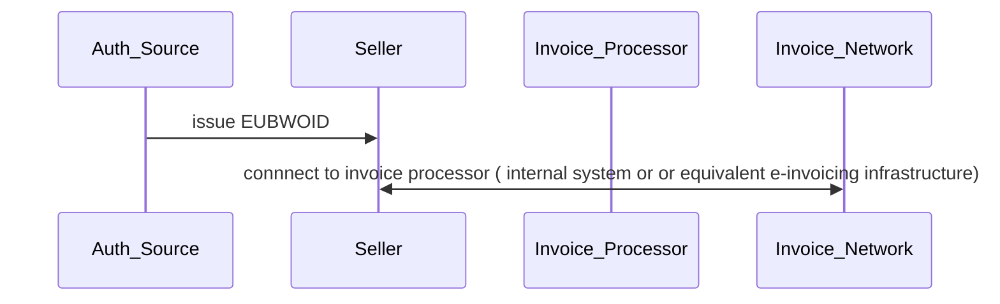
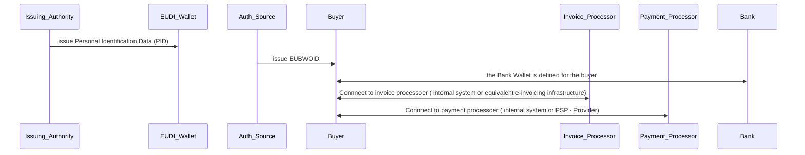
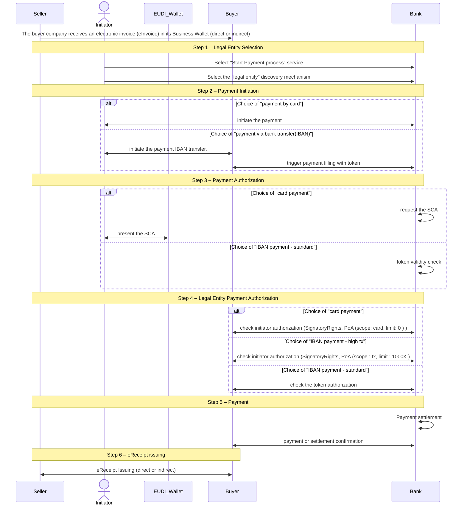

# PA4 MVP Workflow

MVP Restrictions:

## Seller Perspective (Holder)
- The seller has an active European Business Wallet (EUBW) containing only the minimum set of attestations required to execute PA4.
- The seller is not required to complete onboarding with the Home Bank (PA3) or onboarding into the KYS process (BU1 – KYS).

## Buyer Perspective (Relying Party)
- The buyer has an active European Business Wallet (EUBW) containing only the minimum set of attestations required to execute PA4.
- The company is not required to complete onboarding with the Home Bank (PA3) or onboarding into the KYC process (BU1 – KYC).
- the validation of the IBAN  is out of scope (since the KYS process was escaped) 
- It is assumed that the eInvoice has already been received in the Business Wallet. 
- The delivery channel is out of scope for the MVP (part of the SC5)
- Sellers are assumed to be classified only as low- or medium-risk sellers.
- High-risk seller scenarios are out of scope for the MVP.
- The company’s Business Wallet contains a valid Mandate Verifiable Presentation (VP) listing the authorised signatories (SR), as well as the corresponding Power of Attorney (PoA) for the acting person.
- The direct exchange scenario is covered by SC5.
- For the MVP, the onboarding process is executed sequentially as a single-user flow.
- The process ends with the issuance of the eReceipt VC into the Business Wallet, bound to the legal entity.

## Person Perspective
- The natural person acting on behalf of the legal entity holds a valid personal EUDI Wallet containing a PID credential.
- The person is listed as an authorised representative of the company for interactions with the financial sector (SR).
- The person also holds a valid Power of Attorney (PoA) specifying the permitted scope of authority (e.g. transactions without limitation).
- It is assumed that the person holds the SCA attestation in the wallet ( PA1 use case).
- Validation of the company’s authorised representative lists (SR) is out of scope for the MVP.
- The person performs Strong Customer Authentication (SCA) using possession of the wallet device combined with either a PIN or biometric authentication.
- In the case of IBAN-based transactions, the IBAN information provided in the eInvoice is assumed to be trusted. 
- High-risk transaction scenarios are excluded from the MVP scope and may be addressed in a future MVP+ phase.

## Assumptions – Holder Business Wallet
a.Automatic Flow
- Mutual authentication is enabled by default; no TLOL or device-binding checks are applied.
- The buyer wallet is pre-authorized to present and receive attestations; no additional configuration is supported in the MVP.
- The Business Wallet accepts credential offers automatically when an active corporate authorisation session is already established.

b. Manual Flow
- Mutual authentication is reduced to a visual verification step.
- Authorization is reduced to a visual check and manual approval process.

## Assumptions – Relying Party Business Wallet
- Attestation verification for each attestation is limited to:
  a. Cryptographic validation (Section 4.2.1)
  b. Basic issuer identification against an internal trusted list (Sections 4.2.2–4.2.3)

## General 
- It is assumed that the eInvoice has already been received in the Business Wallet.
- Cross-border cases is not part of the MVP.
- The process ends with the issuance of the eReceipt VC into the Business Wallet, bound to the legal entity.

## Pre-requisites
Pre-requisites : These are the pre-requisites for the Seller and  Buyer in order to run the MVP.

1.1 Seller Pre-requisites

1.2 Buyer Pre-requisites

### 1. Scenario 1 

The following diagram provides an overview of the end-to-end process

